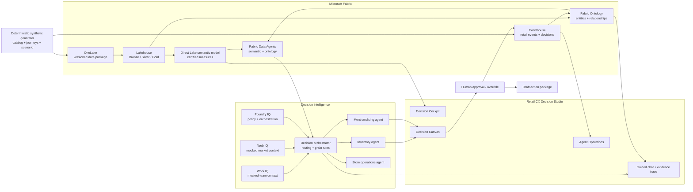

# Retail CX Decision Studio

> **Synthetic demo:** Aster & Pine Outfitters is a fictional retailer. All
> entities, values, recommendations, and decisions are generated for demonstration.

## What the application demonstrates

The application turns a retail signal into a governed decision:

**Signal → diagnosis → relationship context → recommendation → human
approval/override → action package → audit telemetry**

The same user experience can run in two modes:

- **Replay mode** uses deterministic synthetic responses and requires no Fabric
  tenant configuration.
- **Live mode** uses an environment-configured Power BI report, Fabric Data
  Agent, Fabric Ontology, and Eventhouse.

Both modes use the same frontend and API response contracts.

## The four IQ roles

| IQ | Role in the interactive story |
|---|---|
| Work IQ | Mocked assignment, people, communication, calendar, and review context |
| Fabric IQ | Governed semantic measures, ontology relationships, and operational signals |
| Foundry IQ | Mocked policy grounding, orchestration, agent instructions, and typed tools |
| Web IQ | Mocked current public context used to challenge or refine the recommendation |

Story Studio lets the user invoke these layers independently. Fabric Data Agent
questions do not automatically create decisions; the user explicitly triggers
the action agents when analytical context should become a draft recommendation.

## End-to-end architecture



## Which Fabric capability answers what

| Capability | Best question type | Example |
|---|---|---|
| Semantic model | Aggregates, trends, comparisons, rankings, prediction outputs | Which product families are growing inside declining categories? |
| Ontology | Named entities, relationships, paths, and grain context | Which stores carry Momentum Runner and how are they supplied? |
| Eventhouse | Current synthetic events and decision telemetry | Which recommendations were approved in the last hour? |
| Action agents | Evidence-bound recommendations and typed drafts | What should we do without creating stockouts? |

## The Protect the Winner scenario

The fictional **Footwear** category is down **6.2%**, while the
**Momentum Runner** family is up **38%**. The opportunity is real, but inventory
coverage differs by store.

The app combines:

- product-family contribution from the semantic model;
- product, SKU, inventory, store, and fulfillment relationships from the
  ontology;
- explicit coverage and transfer rules from the action agents;
- a human override when a local condition is absent from the data.

The resulting draft plan:

- holds and replenishes Stores A-C;
- activates Stores D-G;
- initially uses Stores H-J as transfer candidates;
- excludes Store J after Dana records local context;
- recalculates the transfer from Stores H and I.

## Why the ontology matters

The semantic model establishes **how much** and **where the variance is**. The
ontology establishes **how the opportunity is connected**:

```text
TradingSignal
  → ProductFamily
  → Product
  → SKU
  → InventorySnapshot
  → Store
  → FulfillmentNode
```

It also connects the recommendation to its evidence, decision, and override.
The ontology is intentionally used for focused graph questions, not broad fact
table aggregation.

## Grain-aware reasoning

The demo explicitly refuses to invent a relationship. Reserved inventory is
available at fulfillment-node/product grain, so it is not allocated to stores
unless a certified allocation exists.

Every recommendation separates:

1. observed facts;
2. derived calculations;
3. business rules;
4. proposed action;
5. limitation or exclusion.

## Human-in-the-loop action pattern

All external actions are drafts:

- replenishment review;
- inter-store transfer review;
- activation brief;
- evidence package;
- decision and override log.

Approval or dismissal changes proposal state. In live mode, those transitions
are appended to Eventhouse so the AI operating layer is measurable and auditable.

## Deployment path

1. Use local replay mode for a reliable presentation.
2. Configure live Fabric item IDs and endpoints through environment variables.
3. Host the web application with delegated identity and managed identity.
4. Optionally wrap the hosted experience in a Fabric Workload for native Fabric
   navigation and lifecycle.
