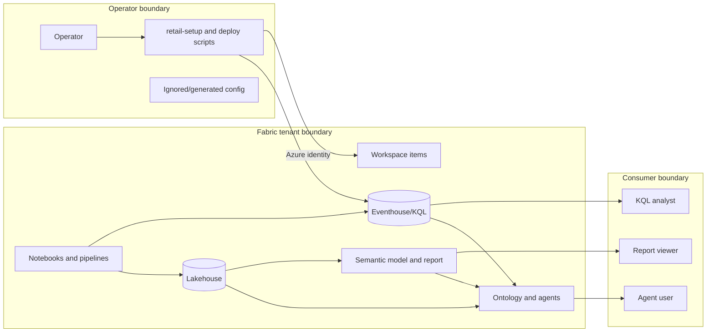

# Security architecture

Threats and mitigations are owned by the
[threat model](../security/threat-model.md) and
[controls](../security/controls.md).

## Trust boundaries

## Identities

- Deploy-time operations use an Azure CLI or Azure PowerShell operator identity.
- KQL schema application runs from the local deploy process.
- The streaming notebook uses its Fabric runtime identity and needs ingestion
  rights on the target KQL database.
- Reports, KQL, ontology, and agents use assigned consumer permissions.

## Data handling

All records are synthetic, but the model includes identity-like customer
fields. Treat names, addresses, phone, loyalty, BLE, and advertising identifiers
as synthetic-but-sensitive.

## Current controls

- Local generation config and generated output are ignored.
- Secrets are expected from identity, secret stores, environment variables, or
  ignored files.
- KQL application is centralized.
- Direct streaming requires pre-existing tables through `FailIfNotExist`.
- Canonical public documentation is built only from reviewed `docs/` content.

## Current gaps

- No checked-in semantic-model RLS roles were found.
- Data Agent instructions and user descriptions are unset.
- Deployment token/target handling has open defects.
- Environment isolation and live readiness are incomplete.
- Required live writes can currently fail without failing the micro-batch.

See [access control](../specifications/modules/security/access-control.md) and
the [security backlog](../requirements/modules/security/backlog.md).
