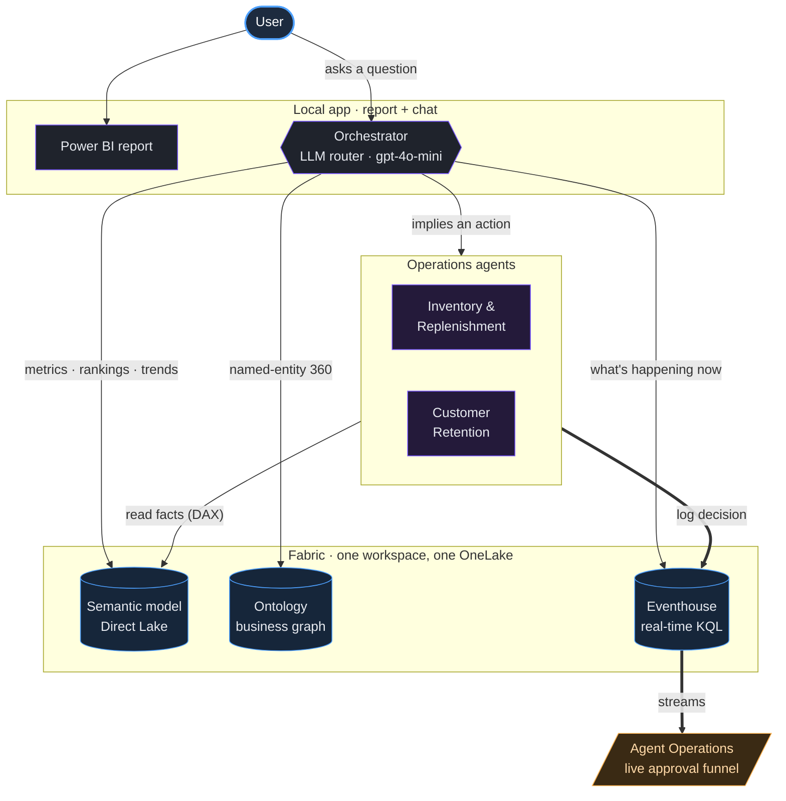

# Agentic Application

This page covers the **conversational analytics + multi-agent action layer** that
sits on top of the Fabric retail platform — end-to-end. We start with what it is
and why it's useful, then walk the architecture left-to-right, then explain how the
orchestrator, the two MCP servers, and the operations agents work under the hood —
all without leaving the single Fabric workspace.

> If you're looking for the data platform itself (streaming, Lakehouse medallion,
> Eventhouse, semantic model), see [Architecture overview](overview.md). This page is the
> **application** that consumes it.

---

## What it is, and why it's useful

The agentic application is a small local web app that puts a **chat interface next
to an embedded Power BI report** and, behind the scenes, a **team of AI agents** over
the deployed `retail-demo` workspace. It does three things a dashboard alone can't:

- **Ask, don't build.** You ask a business question in plain English and a background
  **orchestrator** routes it to the right "brain" — the **semantic model** for metrics,
  the **ontology graph** for entity-360 relationships, or the **real-time Eventhouse**
  for what's happening right now — and tells you which one it used and why.
- **From answers to actions.** When a question implies a *decision* ("stock is low —
  what should we do?"), the orchestrator hands off to a specialized **operations agent**
  that reads the real data, applies business rules, and **drafts an approvable action**
  with a human in the loop.
- **Closed loop, governed.** Every recommendation and every human approval is written
  back into the Fabric **Eventhouse** as real-time telemetry, so the agentic layer is
  measurable and auditable — not a black box bolted on the side.

Critically, this is **one Fabric workspace** — one security boundary, one billing meter,
one copy of the data in OneLake. The same Gold tables feed the report, the agents, and
the ML models; the same Eventhouse that streams live sales also captures what the agents
decide.

---

## End-to-end architecture

Here's the whole picture. On the **left**, the user works in one app surface — a Power BI
report and a chat box side-by-side. In the **middle**, an orchestrator decides which
Fabric capability should answer. On the **right**, those capabilities all read from the
**same OneLake** foundation, and the agents' decisions flow **back** into the Eventhouse.



**The flow, in one breath:** the user asks → the orchestrator routes → a Fabric capability
(or an agent) answers → if it's an action, the agent drafts it for human approval → the
decision is logged to the Eventhouse → it shows up on a live operations dashboard.

---

## The pieces, left to right

### 1. The app surface — report + chat, side by side

The app is a small FastAPI backend serving a single-page front end with three pages:

- **Dashboard** — the **Power BI report (≈70%)** next to the **chat (≈30%)**, so you see
  the visual and the conversation in one frame. The report is embedded
  **user-owns-data**: the backend mints an AAD token from the developer's `az login`
  session, so there's no app registration or service principal to stand up for the demo.
- **Agent Operations** — a live approval-funnel dashboard that streams straight from the
  Eventhouse `agent_actions` table and auto-refreshes (KPI cards, an events-per-minute
  timeline, a per-agent funnel, and a live feed of every recommendation and approval).
- **Ontology Explorer** — renders the business graph (entities and their relationships)
  so you can *show* the model the agents reason over.

There is **no "ask the data agent vs. ask the ontology" toggle.** The user just asks; the
orchestrator picks.

### 2. The orchestrator — which brain answers?

Under the hood, an **LLM intent router** (`gpt-4o-mini` on Azure OpenAI, keyless via AAD)
reads each question and classifies it into one of four routes:

| Route | Goes to | Example question |
|---|---|---|
| Metric / ranking / trend / ML rollup | **Data Agent** → semantic model | "Top 10 stores by net sales, YoY %" |
| Single named entity, in context | **Ontology MCP** → business graph | "What segment and churn risk does loyalty member LC012304678 have?" |
| Right-now / last-N-minutes | **Eventhouse (KQL)** | "Top products in the last 15 minutes" |
| Implies a decision/action | **Operations agent** | "Stock is low — what should we do?" |

The router is **pluggable**: set `RETAIL_LLM_PROVIDER=anthropic` + `RETAIL_ANTHROPIC_API_KEY`
to route with **Claude** instead, and the trace then names the actual model. If the LLM call
fails for any reason, a deterministic **keyword router** takes over, and the chosen analytic
surface still **falls back** to the other if it can't answer (e.g. a graph walk the service
can't complete at scale). Smart by default, deterministic as a safety net.

### 3. The two MCP servers — Data Agent and Ontology

Both Fabric capabilities are reached over **Model Context Protocol (MCP)** — each call is a
single JSON-RPC `POST` to a streamable-HTTP endpoint, authenticated with a Fabric bearer token:

- **Data Agent MCP** (`.../dataagents/{id}/agent`) sits on the **semantic model** and answers
  aggregates, rankings, trends, and ML rollups. It translates NL → DAX **inside Fabric** with
  Fabric's own model and returns the answer (not the DAX).
- **Ontology MCP** (`.../items/{id}/ontologyEndpoint`) exposes the **business graph**. It's
  strongest at **entity-360 lookups** — name one customer and it fuses their business profile
  with their ML **segment** and **churn** prediction in a single hop. It translates NL → graph
  query **inside Fabric** and returns rows + a natural-language summary.

> **Why the ontology matters:** a semantic model is great at aggregates but isn't built to pull
> together *everything we know about one specific entity* into one connected answer. The typed
> business graph (`Customer → Receipt → Product`, `Customer → ChurnPrediction`, `Store → Truck →
> DistributionCenter`) is. Broad aggregations and deep multi-hop scans are routed to the semantic
> model, which handles them far more reliably at scale.

You can connect to both MCP servers directly from **VS Code** to experiment — see the
[VS Code MCP setup](../../guides/deployed-analytics-ai.md#connect-from-vs-code-mcp) for the `.vscode/mcp.json` setup.

### 4. The operations agents — perceive, reason, recommend, log

When a question implies an action, the orchestrator hands off to a specialized agent that
runs **DAX the app itself authors** (so, unlike the two MCPs, its query is fully transparent):

- **Inventory & Replenishment** — reads the ML **stockout-risk** table, cross-checks
  `fact_reorders` for SKUs with no open reorder, joins `dim_products` for price to put a
  **dollar** on the risk, applies a "reorder to a 14-day cover" rule, and **drafts reorders**
  with Approve / Dismiss.
- **Customer Retention** — reads the ML **churn** table, joins `customer_segments` for lifetime
  value, ranks and selects a campaign cohort, pulls cross-sell anchors from the **market-basket**
  model, and **drafts a win-back campaign** with Approve / Dismiss.

Both follow the same pattern: **perceive** the data → **reason** with business rules →
**recommend** a specific, costed action → require a **human approval**.

### 5. The closed loop — write-back to the Eventhouse

Every agent draft and every human approval is logged as an event in the Eventhouse table
**`agent_actions`** — the same real-time store that streams live sales. That gives you a live
**approval funnel** the app renders on the Agent Operations page, and the exact same data is
plain KQL anyone can drop on a Fabric Real-Time Dashboard:

```kusto
agent_actions
| where action_ts > ago(1h)
| summarize count() by bin(action_ts, 1m), action_status
| render timechart
```

The AI's recommendations and your team's approvals become **first-class, governed, queryable
telemetry inside Fabric** — auditable, measurable, and ready to drive the next dashboard.

---

## Under the hood — transparency and which model thinks

### "Show me how the agent got the answer"

Under every answer the chat shows a collapsible **"how I reached this"** trace:

- **Source** — semantic model, ontology graph, or a named operations agent.
- **Router + model** — which router decided and the exact model it used, plus a one-line reason.
- **Call made** — the exact MCP tool + arguments sent (e.g. `search_ontology({...})`).
- **Graph path traversed** *(ontology)* — the entities and relationships the query walked,
  reconstructed from the result columns, with a preview of the actual rows.
- **Queries executed** *(operations agents)* — the **literal DAX** the agent generated and ran.

> **Honesty note:** the Fabric **Data Agent** and **Ontology MCP** generate and run their query
> *server-side* and do **not** return the query text — so for those two we show the call, the
> entities/relationships traversed, and a result preview. The **operations agents** run DAX *we*
> author, so for them we show the full query verbatim.

### Which model is doing the thinking?

There are **three** distinct interpretation steps, and they do **not** all use the same model:

1. **Intent routing** — *our* code, an LLM intent router on Azure OpenAI `gpt-4o-mini` (keyless
   via AAD). **This is the only model we control**, and it's swappable to **Claude** via config.
2. **NL → DAX** (semantic-model answers) — inside the **Fabric Data Agent**, Fabric's own model.
   Not swappable.
3. **NL → graph query** (ontology answers) — inside the **Fabric Ontology service**, Fabric's own
   model. Not swappable.

So "use Claude" is achievable for **routing today** (with an Anthropic key); the query translation
in steps 2–3 is owned by Fabric.

---

## Why this matters

This isn't four products stitched together. It's **one Fabric workspace** — the relationship graph,
the live event stream, the curated metrics, and the ML models all on one copy of the data — with an
**orchestrator that picks the right brain per question** and a **fleet of operations agents** that
turn insight into governed, approvable action and log it back as telemetry. The same pattern adds a
Pricing agent, a Logistics agent, a Marketing agent next — each reading the same foundation. *Fabric
is the operating system for a multi-agent retail business.*

For the presenter's click-path, see the [CIO Walkthrough](../../guides/cio-walkthrough.md).
