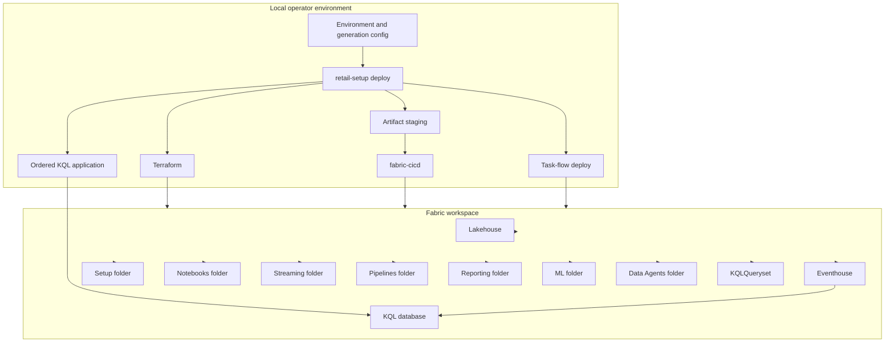

# Infrastructure

## Deployment topology

## Resource ownership

Terraform provisions or resolves the Fabric workspace, Lakehouse, Eventhouse,
KQL database, and optional custom Spark pool. `fabric-cicd` publishes supported
source-control items. KQL schema application runs separately with the operator
identity.

## Current item layout

| Location | Items |
| --- | --- |
| Workspace root | Lakehouse shell, bundled KQL queryset |
| `Setup` | Rendered setup notebooks, `setup-pipeline` |
| `Notebooks` | Core, ML, ontology, and reset notebooks |
| `Streaming` | `stream-events` |
| `Pipelines` | Historical, streaming, maintenance, and ML pipelines |
| `Reporting` | Semantic model and report |
| `ML` | ML experiment shells |
| `Data Agents` | Semantic-model and ontology agents |

## Pipeline topology

| Pipeline | Actual scope | Schedule |
| --- | --- | --- |
| `setup-pipeline` | Setup 01-04, ML 06-14, ontology | On demand |
| `historical-data-load` | Retained historical-load notebook | On demand |
| `streaming-data-load` | Streaming Silver then Gold | Committed schedule disabled |
| `daily-maintenance` | Delta maintenance | Daily schedule enabled |
| `machine-learning` | ML 06-14 | On demand |

## External dependencies

- Microsoft Fabric tenant and capacity
- Terraform 1.8 or later, below 2.0
- Azure CLI for guided setup; Azure CLI or Azure PowerShell for direct deploy
- `fabric-cicd`
- `azure-identity`
- `azure-kusto-data`
- Fabric Spark and Spark Kusto connector

## Local deployment state

Merged configuration generates tracked Terraform and `fabric-cicd` inputs plus
ignored live outputs and staged item folders. Local Terraform state remains in
one checkout-level location and is not isolated per environment. Concurrent or
interleaved dev/test/prod deployment from one checkout is therefore outside the
current safe operating boundary.

## Current constraints

- Environment state and committed operator-specific defaults need stronger
  isolation.
- The default deploy inventory is broader than a GA-safe core profile.
- Task-flow deployment uses metadata behavior outside a stable Fabric item
  source-control contract.
- Local validation does not yet prove live workspace readiness.

See [deployment requirements](../requirements/modules/deployment/deployment.md)
and the [operations backlog](../requirements/modules/operations/backlog.md).
