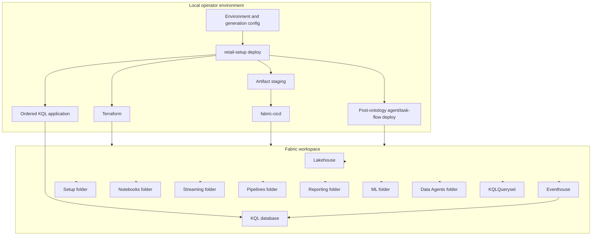

# Infrastructure

## Deployment topology

## Resource ownership

Terraform provisions or resolves the Fabric workspace, Lakehouse, Eventhouse,
KQL database, and optional custom Spark pool. `fabric-cicd` publishes supported
source-control items. KQL schema application runs separately with the operator
identity.

## Current item layout

| Location | Items |
| --- | --- |
| Workspace root | Lakehouse shell, bundled KQL queryset |
| `Setup` | Rendered setup notebooks, `setup-pipeline` |
| `Notebooks` | Core, ML, ontology, and reset notebooks |
| `Streaming` | `stream-events` |
| `Pipelines` | Historical, streaming, maintenance, and ML pipelines |
| `Reporting` | Semantic model and report |
| `ML` | ML experiment shells |
| `Data Agents` | Semantic-model and ontology agents, post-ontology only |

## Pipeline topology

| Pipeline | Actual scope | Schedule |
| --- | --- | --- |
| `setup-pipeline` | Setup 01-04 | On demand; mandatory for Reporting profiles |
| `historical-data-load` | Retained historical-load notebook | On demand |
| `streaming-data-load` | Streaming Silver then Gold | Committed schedule disabled |
| `daily-maintenance` | Delta maintenance | Daily schedule committed disabled |
| `ml-required` | Four required producers, then contract validator | On demand; terminal Reporting gate |
| `ml-optional` | Promoted optional outputs | Full-demo post-Reporting |
| `ml-experimental` | Experimental outputs | Full-demo post-Reporting |

## External dependencies

- Microsoft Fabric tenant and capacity
- Terraform 1.8 or later, below 2.0
- Azure CLI for guided setup and Terraform, or Azure PowerShell for Python
  clients with validated `--skip-terraform` outputs/provider credentials
- `fabric-cicd`
- `azure-identity`
- `azure-kusto-data`
- Fabric Spark and Spark Kusto connector

## Local deployment state

Each workspace name derives a local environment key. Its ignored environment
overlay, Terraform input, backend state, Terraform data directory,
`fabric-cicd` configuration, live outputs, and run journal stay under that
key. Parallel Terraform operations therefore do not share state. Full
publication still uses one ignored `deploy/workspace/` staging tree, so run
concurrent full deploys from separate checkouts.

## Current constraints

- The default `core` inventory is preview-free; `full-demo` is the explicitly
  acknowledged preview/manual boundary.
- Task-flow deployment uses metadata behavior outside a stable Fabric item
  source-control contract.
- Offline validation does not prove live workspace readiness. The separate
  profile-aware verifier queries live Fabric, Kusto, and Lakehouse SQL
  surfaces; actual workspace evidence remains external.

See [deployment requirements](../requirements/modules/deployment/deployment.md)
and the [operations backlog](../requirements/modules/operations/backlog.md).
