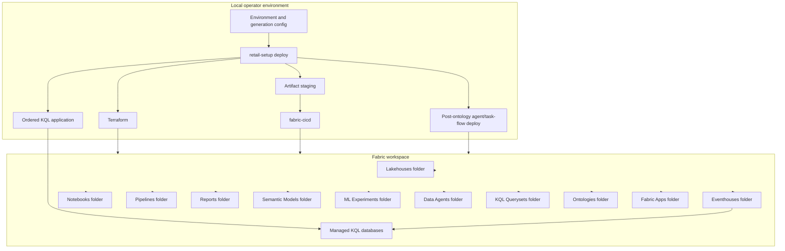

# Infrastructure

## Deployment topology

```mermaid
flowchart TB
    subgraph Local[Local operator environment]
        Config[Environment and generation config]
        CLI[retail-setup deploy]
        TF[Terraform]
        Stage[Artifact staging]
        Publish[fabric-cicd]
        KQL[Ordered KQL application]
        PostOntology[Post-ontology agent/task-flow deploy]
    end

    subgraph Workspace[Fabric workspace]
        LH[Lakehouses folder]
        EH[Eventhouses folder]
        KDB[Managed KQL databases]
        Notebooks[Notebooks folder]
        Pipelines[Pipelines folder]
        Reports[Reports folder]
        Models[Semantic Models folder]
        ML[ML Experiments folder]
        DataAgents[Data Agents folder]
        Queryset[KQL Querysets folder]
        Ontologies[Ontologies folder]
        Apps[Fabric Apps folder]
    end

    Config --> CLI
    CLI --> TF --> Workspace
    CLI --> Stage --> Publish --> Workspace
    CLI --> KQL --> KDB
    CLI --> PostOntology --> Workspace
    Workspace --> LH
    Workspace --> EH --> KDB
    Workspace --> Notebooks
    Workspace --> Pipelines
    Workspace --> Reports
    Workspace --> Models
    Workspace --> ML
    Workspace --> DataAgents
    Workspace --> Queryset
    Workspace --> Ontologies
    Workspace --> Apps
```

## Resource ownership

Terraform provisions or resolves the Fabric workspace, Lakehouse, Eventhouse,
KQL database, and optional custom Spark pool. `fabric-cicd` (Microsoft's
open-source Python library for deploying source-controlled Fabric item
folders) publishes supported workspace items. KQL schema application runs
separately with the operator identity.

Terraform ignores changes to the Lakehouse `description` and `folder_id` and
the Eventhouse `folder_id` (`lifecycle.ignore_changes` in
`deploy/terraform/main.tf`). Later deploy steps own them: `fabric-cicd`
publishes the manifest description and `workspace_folders` moves each item to
its type folder. Without this, every Terraform plan reported drift and reset
both, and the next steps restored them.

## Current item layout

| Location | Items |
| --- | --- |
| `Notebooks` | All selected notebooks, including setup, live driver, ML and case preparation; reset excluded |
| `Pipelines` | All pipelines, including `setup-pipeline` |
| `Reports` | Main report and connected twins |
| `Semantic Models` | Direct Lake semantic model |
| `ML Experiments` | ML experiment shells |
| `Data Agents` | Semantic-model and ontology agents, automatically published after ontology creation in full-demo |
| `Lakehouses` | Lakehouse and its managed SQL endpoint |
| `Eventhouses` | Eventhouses and their managed KQL databases |
| `KQL Querysets` | Bundled KQL queryset |
| `Ontologies` | Ontology and any service-managed children |
| `Fabric Apps` | Merchandising & Replenishment (`retail-approvals`), Promotion Studio (`retail-promotions`), and any service-managed backing items |

The [deployment folder policy](../specifications/modules/deployment/framework.md#workspace-folder-mapping)
also covers independently movable graph models, SQL databases, Operations
Agents and Plans. Fabric moves child items with their parent rather than
allowing separate child folders. These managed exceptions are recorded in
`workspace-folder-report.json`.

## Pipeline topology

| Pipeline | Actual scope | Schedule |
| --- | --- | --- |
| `setup-pipeline` | Setup 01-10 as a dependency graph (02, 04 and 05 after 01; 03 after 04; 06-08 after 03; at most five at once) | On demand; mandatory for Reporting profiles |
| `historical-data-load` | Retained historical-load notebook | On demand |
| `streaming-data-load` | Streaming Silver then Gold; anomaly-alert persistence in parallel | Every 30 minutes (UTC) when `schedules.streaming_data_load` is true (default: on only when `stream.start_after_deploy` is true) |
| `daily-maintenance` | Delta maintenance, demand-forecast and stockout models, then the Operations Agent signal refresh | Daily 00:00 Eastern when `schedules.daily_maintenance` is true (default on) |
| `ml-required` | Two waves: Gold (`setup-11`), demand forecast, market basket, promotion effectiveness and stockout risk; then segmentation and churn; then the contract validator. Producers and Gold retry once | On demand; terminal Reporting gate |
| `ml-optional` | Promoted optional outputs | Full-demo post-Reporting |
| `ml-experimental` | Experimental outputs | Full-demo post-Reporting |

## External dependencies

- Microsoft Fabric tenant and capacity
- Terraform 1.8 or later, below 2.0
- Azure CLI for guided setup and Terraform, or Azure PowerShell for Python
  clients with validated `--skip-terraform` outputs/provider credentials
- `fabric-cicd`
- `azure-identity`
- `azure-kusto-data`
- `mssql-python` on Windows/Linux, or Microsoft ODBC Driver 17/18 on macOS,
  for Lakehouse SQL readiness checks
- Fabric Spark and Spark Kusto connector

Exact versions are pinned in the hash-locked `utility/requirements-deploy.txt`
(currently `fabric-cicd` 1.4.0, `azure-identity` 1.27.0, `msal` 1.39.0,
`mssql-python` 1.18.0, `pyodbc` 5.5.0, `azure-kusto-data` 6.0.4, and
`jsonpath-ng` 1.7.0, which `fabric-cicd` 1.4.0 caps below 1.8) and in
`deploy/terraform/providers.tf` with its lock file (`microsoft/fabric` 1.15.1).

## Local deployment state

Each workspace name determines a local environment key. Its ignored environment
overlay, Terraform input, backend state, Terraform data directory,
`fabric-cicd` configuration, live outputs, and run journal stay under that
key. Generation configuration lives at
`utility/config/environments/<env>.yaml`, rendered notebooks at
`utility/out/<env>/`, and every publication phase stages under
`deploy/.generated/<env>/workspace/`. Different environments do not share
these local paths. Operators must still serialize runs for the same Fabric
target; path isolation is not a distributed lock.

## Current constraints

- The default `full-demo` inventory includes live-preflight-validated preview
  features; explicitly selected `core` and `standard` inventories are
  preview-free.
- Task-flow deployment uses metadata behavior outside a stable Fabric item
  source-control contract.
- Offline validation does not prove live workspace readiness. The separate
  profile-aware verifier queries Fabric, Kusto, and Lakehouse SQL.
  Prior full-demo evidence does not validate later changes. Collect fresh
  required-path and optional-stream evidence for each environment and run.

See [deployment requirements](../requirements/modules/deployment/deployment.md)
and the [operations backlog](../requirements/modules/operations/backlog.md).
