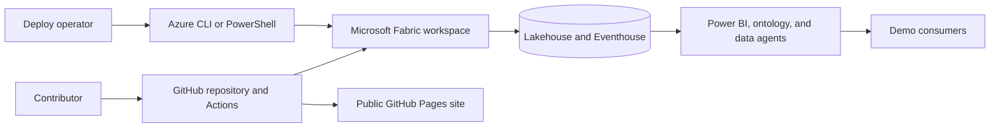

# Threat model

This document owns the security threats for the Microsoft Fabric Retail Demo. The
related controls are defined in [controls.md](controls.md), and implementation
evidence is tracked in
[requirements traceability](../requirements/traceability.md).

## Scope and assumptions

- Microsoft Entra ID is the identity plane for Fabric access.
- Operators authenticate with Azure CLI or Azure PowerShell.
- GitHub Actions builds documentation and may run other privileged automation.
- The data is synthetic, but identity-like fields can still create disclosure,
  misuse, and governance risk.
- Preview Fabric features are not assumed to exist in every tenant.
- Generated files, local configuration, and deployment output are not trusted
  as durable sources of truth.

## Assets

- Fabric workspace roles, item permissions, and resource bindings.
- Lakehouse, Eventhouse, semantic-model, ontology, and data-agent data access.
- Deployment credentials, tokens, and environment-specific identifiers.
- Audit, run-history, freshness, and verification evidence.
- Canonical documentation and the public static site.

## Trust boundaries

## Threats

| ID | Threat | Impact | Required controls | Residual risk |
| --- | --- | --- | --- | --- |
| `THREAT-001` | Over-privileged workspace or model access exposes row-level customer-like data. | Unintended disclosure and misleading claims that synthetic data needs no governance. | `SEC-001`, `SEC-002`, `SEC-004`, `SEC-005` | The current model includes identity-like fields and has no checked-in RLS role. |
| `THREAT-002` | Credentials or bearer tokens are committed, logged, masked incorrectly, or sent to the wrong endpoint. | Unauthorized Fabric or Azure access and failed deployment. | `SEC-001`, `SEC-003`, `SEC-009` | Several deploy helpers require the authentication repair tracked by `IMP-001`. |
| `THREAT-003` | A data agent or ontology answers beyond its intended persona or retrieves sensitive detail. | Excessive data disclosure and unsafe AI-generated guidance. | `SEC-004`, `SEC-005`, `SEC-006` | Agent instructions and least-privilege defaults are not yet complete. |
| `THREAT-004` | Mutable workflow actions, plugins, or dependencies execute with privileged tokens. | Supply-chain compromise or unreviewed behavior changes. | `SEC-007` | Repository-executed references and dependency sets are immutable and contract-tested; package registries, OS package managers, and hosted runner images remain external trust roots. |
| `THREAT-005` | Security-relevant activity, deployment state, or data freshness is not centrally observable. | Incidents and stale demo output can go undetected. | `SEC-008` | Monitoring is partly procedural and fragmented across Fabric surfaces. |
| `THREAT-006` | Environment misbinding or an unsafe reset targets the wrong tenant, workspace, or state. | Cross-environment modification or destructive data loss. | `SEC-001`, `SEC-009` | Terraform state isolation and live target validation remain open work. |
| `THREAT-007` | Required streaming or post-deploy failures are treated as success. | Integrity loss, advanced checkpoints, and false operational confidence. | `SEC-008`, `SEC-011` | Fail-fast and replay-safe execution are tracked by `IMP-002`. |
| `THREAT-008` | Public documentation publishes secrets, tenant-specific values, or temporary internal evidence. | Information disclosure and stale operational guidance. | `SEC-003`, `SEC-010` | Review is still required for every newly public document. |

## Review triggers

Review this model when authentication changes, new public endpoints or agents
are added, data classification changes, a preview feature becomes part of the
default profile, or the documentation publishing boundary changes.
