# Deployment framework

## Current order

The supported deploy orchestrator is `retail-setup deploy`.

```mermaid
flowchart LR
    Resolve[Resolve manifest profile]
    Preflight[Validate profile preflight]
    Config[Generate environment config]
    TF[Terraform init/apply or resolve existing outputs]
    StageInfra[Stage infrastructure without Reporting]
    PublishInfra[Publish infrastructure]
    KQL[Build and execute ordered KQL script]
    Setup[Wait for setup-pipeline]
    RequiredML[Wait for ml-required + validator]
    StageReporting[Stage Reporting]
    PublishReporting[Publish Reporting]
    ExtendedML[Run selected post-Reporting ML]
    Validate[Validate publication]
    InitialVerify[Verify with post-ontology checks deferred]
    Ontology[Operator creates ontology]
    Agents[Publish Data Agents]
    TaskFlow[Deploy resolved task flow]
    FinalVerify[Verify complete readiness]

    Resolve --> Preflight --> Config --> TF --> StageInfra --> PublishInfra --> KQL
    KQL --> Setup --> RequiredML --> StageReporting --> PublishReporting
    PublishReporting --> ExtendedML --> Validate --> InitialVerify
    InitialVerify --> Ontology --> Agents --> TaskFlow --> FinalVerify
```



Preflight is the first executable plan step and precedes every destroy, apply,
publish, and KQL mutation. It validates local/queryable facts and explicit
operator acknowledgements. It does not fabricate tenant preview or capacity
APIs.

The current CLI applies Terraform directly; it does not insert a separate
interactive `terraform plan` step. The CLI confirmation occurs before apply;
Terraform then prints its change preview and proceeds with `-auto-approve`.

## Command modes

| Mode | Exact behavior |
| --- | --- |
| `--dry-run` | Validates existing configuration and the Terraform/Python authentication boundary, then prints the plan without subprocess execution or live target access. With `--skip-terraform`, it also validates captured outputs. |
| `--yes` | Pre-confirms gated Terraform steps and existing-workspace handling; it never skips required pipeline gates. |
| `--skip-terraform` | Omits Terraform only after captured outputs match the selected environment, workspace, resource names, and non-placeholder IDs. |
| `--recreate` | Runs destroy, polls Fabric until the workspace name is absent (bounded at 180 seconds), then applies and publishes. |
| `--acknowledge <id>` | Records one explicit `full-demo` preview, capacity, task-flow, or manual boundary; it cannot bypass a blocker. |

`--recreate` and `--skip-terraform` are mutually exclusive. A normal
interactive run detects an existing workspace by display name and offers
update-in-place or recreate. `--yes` skips that prompt.

## Workspace-scoped environments

`configure` derives one environment key from the Fabric workspace name. It
lowercases the name, converts punctuation and spaces to hyphens, and omits a
leading `retail-demo-` prefix. For example, `retail-demo-alice` becomes
`alice`.

Each key owns one ignored target overlay and one ignored generated directory.
The overlay contains operator-specific tenant, capacity, workspace, and
optional existing-item identifiers. The tracked `deploy.yml` contains shared
defaults only. After Terraform, `fabric-cicd` targets the validated workspace
ID rather than resolving a potentially duplicate display name.

## Generated files

| Path | Role | Tracked |
| --- | --- | --- |
| `deploy/config/environments/<env>.yml` | Workspace-specific target overlay | No |
| `deploy/.generated/<env>/terraform.tfvars` | Terraform input rendered from merged YAML | No |
| `deploy/.generated/<env>/terraform.tfstate` | Local Terraform backend state | No |
| `deploy/.generated/<env>/.terraform/` | Terraform backend and provider data | No |
| `deploy/.generated/<env>/fabric-cicd/config.yml` | Publication environment and item scope | No |
| `deploy/.generated/<env>/fabric-cicd/parameter.yml` | Workspace, item, OneLake, KQL, and agent rewrites | No |
| `deploy/.generated/<env>/terraform-output.json` | Captured live identifiers | No |
| `deploy/.generated/<env>/database.kql` | Combined ordered KQL script | No |
| `deploy/.generated/<env>/deploy-run.json` | Atomic step/status journal for the latest deploy run | No |
| `deploy/.generated/<env>/artifact-inventory-<phase>.json` | Validated manifest/profile/count/folder inventory for one publication phase | No |
| `deploy/.generated/<env>/readiness-report.json` | Redacted profile-aware live evidence | No |
| `deploy/workspace/` | Staged Fabric item folders | No, except `.gitkeep` |

Terraform receives an environment-specific `TF_DATA_DIR` and local backend
path. Parallel Terraform operations therefore cannot select or mutate another
workspace's state. Full publication still shares `deploy/workspace/` staging,
so concurrent full deploy runs require separate checkouts.

A legacy `deploy/terraform/terraform.tfstate` with no environment-local state
fails preflight. The operator must verify its workspace ownership and move it
to exactly one `deploy/.generated/<env>/terraform.tfstate` path.

If environment-local state exists, preflight reconciles its profile, resource,
and target-output signals with `terraform-output.json`. Missing profile
evidence, missing captures, or stale identities fail closed even when the state
currently has no managed instances. A downgrade that would remove a
profile-controlled Eventhouse or custom Spark pool requires explicit
`--recreate`; absent evidence never authorizes deletion.

## Authentication boundary

Azure CLI mode is shared by the Python clients and Fabric Terraform provider.
The CLI tenant is validated before mutation, and Terraform receives an
explicit `tenant_id`.

Azure PowerShell mode applies only to Python Fabric clients. Terraform
apply/destroy is rejected before command execution unless exactly one
provider-supported service-principal secret/certificate, OIDC, or
managed-identity credential is configured. Otherwise the operator must use
validated prior outputs with `--skip-terraform`. In this mode the provider's
Azure CLI fallback is disabled, preventing an unrelated CLI context from being
used silently; conflicting provider tenant variables are rejected.

## Manifest authority and executable profiles

`contracts/retail-demo.json` owns stable asset IDs/descriptions, support
metadata, dependencies, profile-to-existing-asset/group selection, expected
publication counts/folders, canonical commands/prerequisites, and readiness
expectations. Physical item and schema definitions remain in `deploy/config/deploy.yml`,
`deploy/scripts/build_artifacts.py`, and the source folders. Manifest source
pointers are validated rather than used to duplicate physical schemas.

Resolution computes dependency closure and rejects unknown, cyclic, or
unclassified selected assets. Pipeline selection is exact and independent of
notebook references. All profiles exclude the destructive `reset` group.

| Profile | Assets | Groups | Pipelines | KQL scripts | Publication behavior |
| --- | ---: | --- | ---: | ---: | --- |
| `core` (default) | 1 | `setup` | 0 | 0 | Lakehouse shell and four rendered historical setup notebooks; no Eventhouse, Reporting, ML, stream, preview, task flow, or custom pool |
| `standard` | 8 | `setup`, `core`, `stream`, `ml-required` | 5 | 6 | Supported real-time/streaming plus fail-closed required ML/Reporting path; starter pool and no preview surfaces |
| `full-demo` | 14 | standard groups plus `ml-optional`, `ml-experimental`, `ontology`, `utility` | 7 | 6 | Required Reporting gate plus post-Reporting extended ML and advanced/preview surfaces except reset |

The exact initial infrastructure/Reporting counts are `5+0`, `26+2`, and `40+2`
respectively. They and the workspace-folder sets are validated while staging;
every staged `.platform` description is projected from the selected manifest
asset. See the canonical
[workspace inventory](../../../../guides/workspace-inventory.md).
The prior `IMP-008` profile blockers are removed because the required path is
now executable and fail-closed. Full-demo still requires these
undetectable-boundary acknowledgements:

- `ack.full-demo.preview-surfaces`
- `ack.full-demo.custom-pool-capacity`
- `ack.full-demo.task-flow-api`
- `ack.full-demo.manual-assets`

No profile enables schedules or starts the live stream. The source
daily-maintenance schedule remains present but disabled. Dashboard templates
and rule definitions remain manual sources even though full-demo classifies
them in its logical inventory.

## Two-phase Reporting publication

For `standard` and `full-demo`, the orchestrator:

1. stages and publishes infrastructure, notebooks, experiments, and pipelines
   without the `Reporting` folder;
2. waits for `setup-pipeline` to complete;
3. starts `ml-required` and polls that exact run to a bounded terminal state;
4. stages and publishes the semantic model and report only after status
   `Completed`;
5. runs any selected optional/experimental pipelines after Reporting.

The required pipeline's final activity is
`15-validate-required-ml-contract`. A missing, empty, schema-incompatible,
duplicate, invalid, or temporally incomplete required output fails the
pipeline. Skipped, failed, cancelled, deduplicated, timed-out, or unknown run
states all fail closed and leave Reporting unpublished. Optional and
experimental failures mark the journal `DEGRADED` but do not retract required
Reporting.

## Workspace folder mapping

| Asset | Workspace location |
| --- | --- |
| Lakehouse shell and bundled KQL queryset | Workspace root |
| Setup notebooks and `setup-pipeline` | `Setup` |
| Core, ML, and ontology notebooks | `Notebooks` |
| `stream-events` | `Streaming` |
| Semantic model and report | `Reporting` |
| Other Data Pipelines | `Pipelines` |
| ML experiment shells | `ML` |
| Data Agents (post-ontology only) | `Data Agents` |

Terraform owns Eventhouse/KQL database resources. The staging process does not
publish `.platform`-only Eventhouse shells. The reset notebook has a physical
source but no automatic profile stages it.

## Item types

The resolver derives `item_types_in_scope` from the selected assets:

- `core`: `Lakehouse`, `Notebook`
- `standard`: core plus `SemanticModel`, `Report`, `KQLQueryset`,
  `DataPipeline`, and `MLExperiment`
- `full-demo`: standard plus `DataAgent`

The configured broad list is an available-type allowlist, not an instruction to
publish every type. A selected type absent from that allowlist fails
resolution.

## Parameter rewrites

Generated `parameter.yml` rules rewrite:

- OneLake and Direct Lake source identifiers;
- pipeline workspace and notebook IDs;
- KQL database item IDs and query URIs;
- semantic-model connection IDs where configured;
- Data Agent workspace, semantic-model, and ontology item IDs.

## KQL application

`deploy/scripts/apply_kql.py` concatenates only the ordered KQL files selected
by the profile into one outer database-script payload and can execute it
against the resolved KQL database with the Kusto Python SDK. Executing KQL
without an environment/profile inventory is unsupported. Core selects no KQL.

The required target is the configured KQL database, not a hard-coded default.
The current topology uses the default database created with the Eventhouse and
therefore requires the same display name. Artifact staging rewrites only the
known shortcut, ontology, stream, and queryset target names in generated
copies. Both credential modes receive the configured tenant. Live Azure
PowerShell and renamed-target verification are tracked by
[IMP-001](../../../requirements/modules/deployment/backlog.md#imp-001).

## Task flow and ontology timing

The orchestrator supplies Terraform output to task-flow deployment, so the
workspace, Lakehouse, Eventhouse, and KQL database bind by resolved ID.
Published items not owned by Terraform still bind by type and display name.
`--workspace <name-or-id>` remains an alternative target, but deployment still
requires matching `--environment` and `--profile full-demo`; unscoped legacy
task-flow deployment fails.

Ontology creation is a separate manual preview boundary, not part of
`setup-pipeline` or the required Reporting gate. Initial `full-demo`
publication omits Data Agents and task flow, then records readiness with those
ontology-dependent checks explicitly deferred. After running
`30-create-ontology`, invoke:

```powershell
retail-setup post-ontology --env <env> `
  --acknowledge ack.full-demo.ontology-created
```

This command validates that exactly one target ontology exists before
mutation, stages and publishes Data Agents, deploys the task flow, and runs
complete readiness verification.

Task-flow deployment fails before publication when any selected reference is
unresolved; it never publishes a silently partial graph. The acknowledged
post-ontology command is the only automatic path across this preview/manual
boundary.

Task-flow publication currently relies on Fabric/Power BI metadata behavior
that is not a stable public source-control item contract.

## Failure semantics

- Required initial plan commands and acknowledged post-ontology commands fail
  their respective run.
- Blockers, missing/unknown/repeated acknowledgements, missing selected sources,
  invalid pipeline references, and unsafe profile downgrades fail before
  mutation.
- For gated profiles, setup and required ML are mandatory exact-run terminal
  gates. `--yes` suppresses prompts but never skips either gate.
- Post-Reporting optional/experimental ML failures are recorded and execution
  continues.
- Recreate polls every visible Fabric workspace page and fails closed on timeout
  or malformed pagination before Terraform apply.
- `deploy-run.json` records `PENDING`, `RUNNING`, `SUCCEEDED`, `DEGRADED`,
  `SKIPPED`, and `FAILED` step states plus overall `RUNNING`, `SUCCEEDED`,
  `DEGRADED`, or `FAILED`. It stores no raw command output, environment
  variables, tokens, or tenant identifiers and redacts credential-like
  exception text.
- Local deployment validation checks generated files only; it does not query
  live item, binding, run, or data readiness.

Standard and full-demo run the profile-aware live verifier after their
pipeline gates. The initial full-demo pass defers only ontology, Data Agent,
and task-flow evidence; the post-ontology command runs the complete pass. Both
are read-only: they do not trigger a second pipeline. Required failed/unknown evidence fails deployment; optional
failed/unknown evidence marks the journal and linked readiness report
`DEGRADED`. Operators may explicitly trigger the profile's post-publish
pipeline only with `retail-setup verify --env <env> --run-pipeline`.

The verifier, report, and local contracts are implemented. Actual Fabric
execution and freshness evidence remain
[IMP-013](../../../requirements/modules/operations/backlog.md#imp-013).

## Evidence

- `utility/src/retail_setup/cli/main.py`
- `deploy/scripts/build_artifacts.py`
- `deploy/scripts/deploy_config.py`
- `deploy/scripts/apply_kql.py`
- `deploy/scripts/taskflow.py`
- `deploy/scripts/run_pipeline.py`
- `deploy/scripts/fabric_runtime.py`
- `deploy/scripts/verify_readiness.py`
- `tests/deploy/`
