# Deployment framework

## Current order

The supported deploy orchestrator is `retail-setup deploy`.

```mermaid
flowchart LR
    Config[Generate environment config]
    TF[Terraform init/apply or resolve existing outputs]
    Stage[Stage Fabric item folders]
    Publish[fabric-cicd publish]
    KQL[Build and execute ordered KQL script]
    Validate[Validate generated deployment]
    TaskFlow[Deploy task flow]
    Pipeline[Optional setup-pipeline run]

    Config --> TF --> Stage --> Publish --> KQL --> Validate --> TaskFlow --> Pipeline
```



The current CLI applies Terraform directly; it does not insert a separate
interactive `terraform plan` step. The CLI confirmation occurs before apply;
Terraform then prints its change preview and proceeds with `-auto-approve`.

## Command modes

| Mode | Exact behavior |
| --- | --- |
| `--dry-run` | Prints the command plan without authentication, subprocess execution, or live target validation. |
| `--yes` | Pre-confirms gated Terraform steps and suppresses the post-deploy setup-pipeline prompt. |
| `--skip-terraform` | Omits Terraform only after captured outputs match the selected environment, workspace, resource names, and non-placeholder IDs. |
| `--recreate` | Runs destroy, polls Fabric until the workspace name is absent (bounded at 180 seconds), then applies and publishes. |

`--recreate` and `--skip-terraform` are mutually exclusive. A normal
interactive run detects an existing workspace by display name and offers
update-in-place or recreate. `--yes` skips that prompt.

## Workspace-scoped environments

`configure` derives one environment key from the Fabric workspace name. It
lowercases the name, converts punctuation and spaces to hyphens, and omits a
leading `retail-demo-` prefix. For example, `retail-demo-alice` becomes
`alice`.

Each key owns one ignored target overlay and one ignored generated directory.
The overlay contains operator-specific tenant, capacity, workspace, and
optional existing-item identifiers. The tracked `deploy.yml` contains shared
defaults only. After Terraform, `fabric-cicd` targets the validated workspace
ID rather than resolving a potentially duplicate display name.

## Generated files

| Path | Role | Tracked |
| --- | --- | --- |
| `deploy/config/environments/<env>.yml` | Workspace-specific target overlay | No |
| `deploy/.generated/<env>/terraform.tfvars` | Terraform input rendered from merged YAML | No |
| `deploy/.generated/<env>/terraform.tfstate` | Local Terraform backend state | No |
| `deploy/.generated/<env>/.terraform/` | Terraform backend and provider data | No |
| `deploy/.generated/<env>/fabric-cicd/config.yml` | Publication environment and item scope | No |
| `deploy/.generated/<env>/fabric-cicd/parameter.yml` | Workspace, item, OneLake, KQL, and agent rewrites | No |
| `deploy/.generated/<env>/terraform-output.json` | Captured live identifiers | No |
| `deploy/.generated/<env>/database.kql` | Combined ordered KQL script | No |
| `deploy/workspace/` | Staged Fabric item folders | No, except `.gitkeep` |

Terraform receives an environment-specific `TF_DATA_DIR` and local backend
path. Parallel Terraform operations therefore cannot select or mutate another
workspace's state. Full publication still shares `deploy/workspace/` staging,
so concurrent full deploy runs require separate checkouts.

A legacy `deploy/terraform/terraform.tfstate` with no environment-local state
fails preflight. The operator must verify its workspace ownership and move it
to exactly one `deploy/.generated/<env>/terraform.tfstate` path.

## Current notebook groups

The deploy plan currently stages these groups regardless of
`deploy.yml:notebooks.include`:

- `core`
- `setup`
- `ml`
- `ontology`
- `reset`
- `stream`

This is current behavior, not the desired tiered-profile design.

## Workspace folder mapping

| Asset | Workspace location |
| --- | --- |
| Lakehouse shell and bundled KQL queryset | Workspace root |
| Setup notebooks and `setup-pipeline` | `Setup` |
| Core, ML, ontology, and reset notebooks | `Notebooks` |
| `stream-events` | `Streaming` |
| Semantic model and report | `Reporting` |
| Other Data Pipelines | `Pipelines` |
| ML experiment shells | `ML` |
| Data Agents | `Data Agents` |

Terraform owns Eventhouse/KQL database resources. The staging process does not
publish `.platform`-only Eventhouse shells.

## Item types

Current `item_types_in_scope`:

- `Lakehouse`
- `Notebook`
- `SemanticModel`
- `Report`
- `KQLQueryset`
- `DataPipeline`
- `MLExperiment`
- `DataAgent`

Dashboard templates and rule definitions remain manual/source inputs until
their publishable Fabric item formats and bindings are validated.

## Parameter rewrites

Generated `parameter.yml` rules rewrite:

- OneLake and Direct Lake source identifiers;
- pipeline workspace and notebook IDs;
- KQL database item IDs and query URIs;
- semantic-model connection IDs where configured;
- Data Agent workspace, semantic-model, and ontology item IDs.

## KQL application

`deploy/scripts/apply_kql.py` concatenates ordered
`fabric/kql_database/*.kql` files into one outer database-script payload and can
execute it against the resolved KQL database with the Kusto Python SDK.

The required target is the configured KQL database, not a hard-coded default.
The current topology uses the default database created with the Eventhouse and
therefore requires the same display name. The normal Azure CLI path resolves
the workspace and database IDs from Terraform output. Azure PowerShell and
renamed-target verification are tracked by
[IMP-001](../../../requirements/modules/deployment/backlog.md#imp-001).

## Task flow and ontology timing

Task flow deployment resolves items by display name. The ontology is created at
the end of `setup-pipeline`, after the initial task-flow deploy. Re-run:

```powershell
python -m deploy.scripts.taskflow deploy --workspace <workspace-name>
```

after ontology creation to bind the ontology node and dependent assets.

Task-flow publication currently relies on Fabric/Power BI metadata behavior
that is not a stable public source-control item contract.

## Failure semantics

- Required plan commands fail the main plan.
- Task-flow deployment currently reports an error and continues.
- Setup-pipeline trigger retries, then prints a manual fallback.
- Recreate currently uses a fixed wait after destroy.
- Local deployment validation checks generated files only; it does not query
  live item, binding, run, or data readiness.

The required fail-fast, replay-safe, and deletion-polling behavior is owned by
[IMP-002](../../../requirements/modules/operations/backlog.md#imp-002).

## Evidence

- `utility/src/retail_setup/cli/main.py`
- `deploy/scripts/build_artifacts.py`
- `deploy/scripts/deploy_config.py`
- `deploy/scripts/apply_kql.py`
- `deploy/scripts/taskflow.py`
- `deploy/scripts/run_pipeline.py`
- `tests/deploy/`
