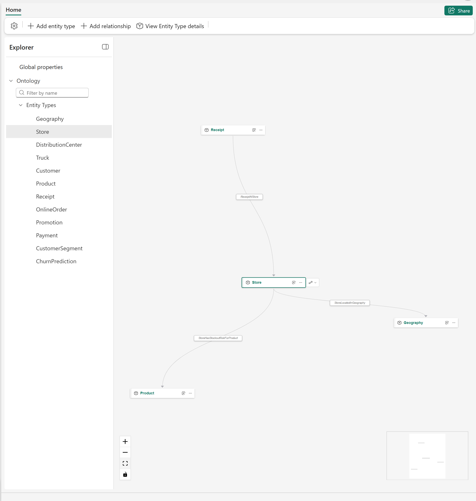
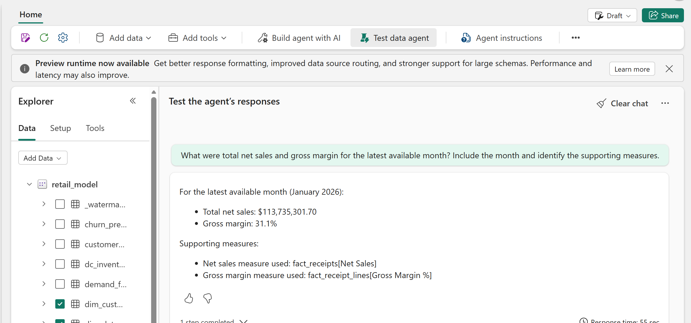
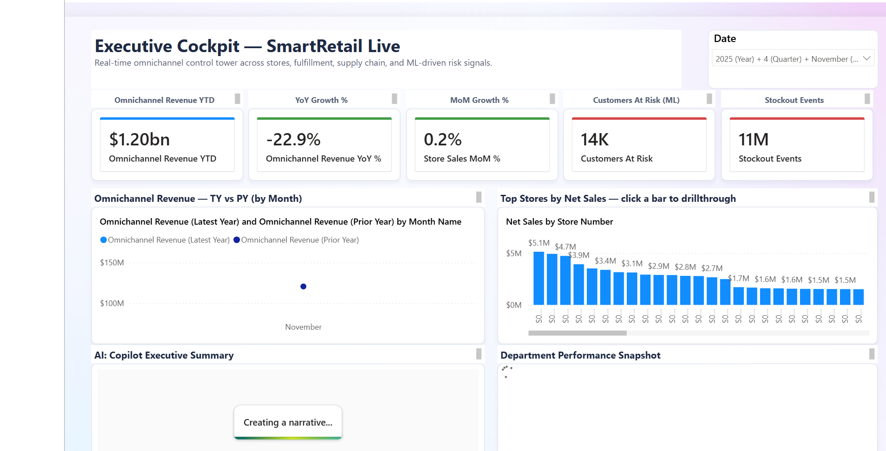
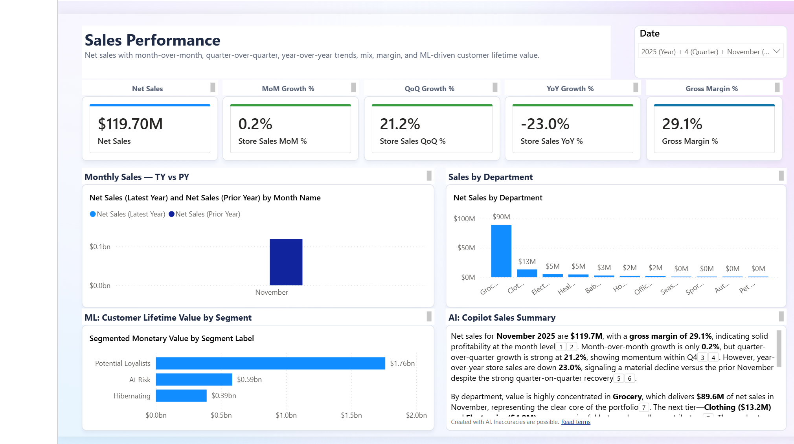
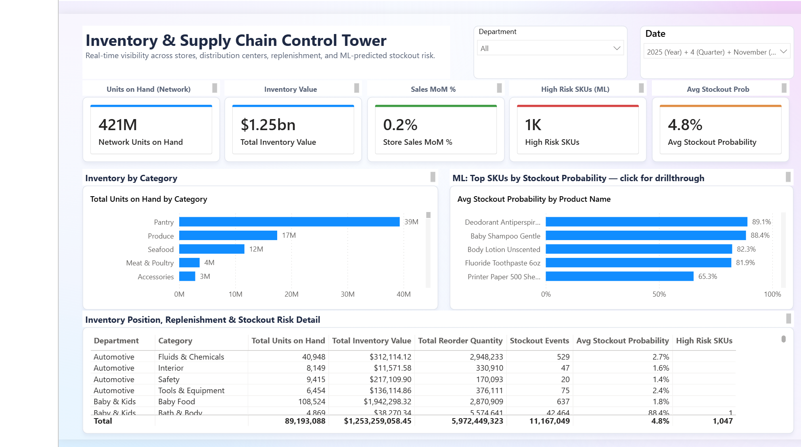
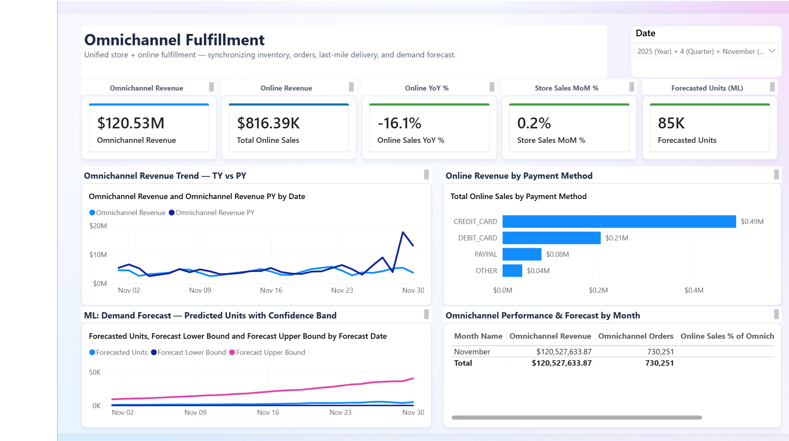
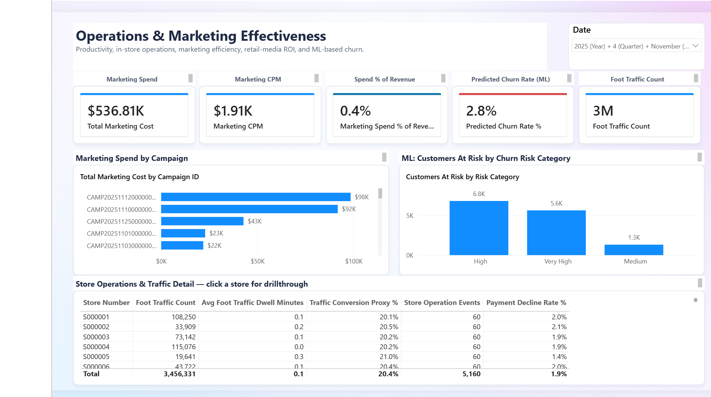

# Deployed walkthrough: analytics and AI

- **Audience:** Retail, analytics, and business stakeholders
- **Duration:** 10-15 minutes
- **Data:** Synthetic

Use this page after the
[deployed walkthrough overview](deployed-walkthrough.md) to show business
context, grounded agent answers, and the Power BI outcome.

!!! note "Optional surfaces"

    Ontology and data-agent experiences require valid source bindings,
    permissions, and capability support. Skip a surface that has not passed
    its preflight checks.

## 1. Show business context in the ontology

If ontology support passed its deployment and binding gates:

1. Open the **Ontologies** folder.
2. Open **Retail Ontology**.
3. Select the `Store` entity type.
4. Use **Fit view** to show its connected entities.

*The selected Store entity connects operational data to Receipt, Geography,
and Product business concepts.*

Explain that the ontology adds shared business meaning over existing Lakehouse
and Eventhouse data. It does not replace the physical schema or create a second
copy of the source data.

## 2. Test a grounded data-agent answer

If the semantic-model agent passed its source and permission checks:

1. Open the **Agents** folder.
2. Open `retail-semantic-model-agent`.
3. Select **Test data agent**.
4. Ask for the latest available month, total net sales, gross margin, and the
   supporting measures.

*The data agent returns the selected period, values, and supporting semantic
model measures so the answer can be checked against the report.*

The agent's latest available month can differ from the report's current date
slicer. State both periods before comparing values. Treat every generated
answer as a hypothesis to verify against measures, query output, and source
timestamps.

Skip an agent when it has no selected data sources, returns an error, or has
not passed its capability and access checks. The ontology graph can still be
shown independently when its bindings are valid.

## 3. Close with the Power BI outcome

1. Open the **Reporting** folder.
2. Open the `retail_model` report.
3. Start on **Executive Cockpit**.
4. Continue to **Sales**, **Supply Chain Control Tower**, **Omnichannel
   Fulfillment**, or **Operations & Marketing** when the audience wants more
   detail.

*The Executive Cockpit combines omnichannel performance, store comparisons,
ML risk signals, and an AI-generated narrative over the Direct Lake semantic
model.*

State the selected data period before discussing a value. All values are
synthetic, and an AI-generated narrative can contain inaccuracies. Use the
underlying measures and source timestamps as evidence.

### Report page gallery

=== "Sales"

    

    *Sales Performance combines revenue, growth, margin, department mix, and
    customer-lifetime-value signals.*

=== "Supply chain"

    

    *The control tower combines inventory position, replenishment, and
    ML-predicted stockout risk.*

=== "Omnichannel"

    

    *Omnichannel Fulfillment combines store and online revenue with payment
    mix and demand forecasting.*

=== "Operations and marketing"

    

    *Operations and Marketing combines campaign spend, churn risk, foot
    traffic, store operations, and payment-decline context.*

## Analytics and AI validation

| Interaction | Expected result |
| --- | --- |
| Select the ontology `Store` entity | Related business entities and relationship names appear in the graph. |
| Ask the semantic-model agent for latest sales | The answer includes a data period and supporting measures that can be independently checked. |
| Open Executive Cockpit | Report visuals load for the selected data period without model or binding errors. |

Return to the [walkthrough overview](deployed-walkthrough.md) or use a focused
[presenter journey](presenter-journeys.md).
