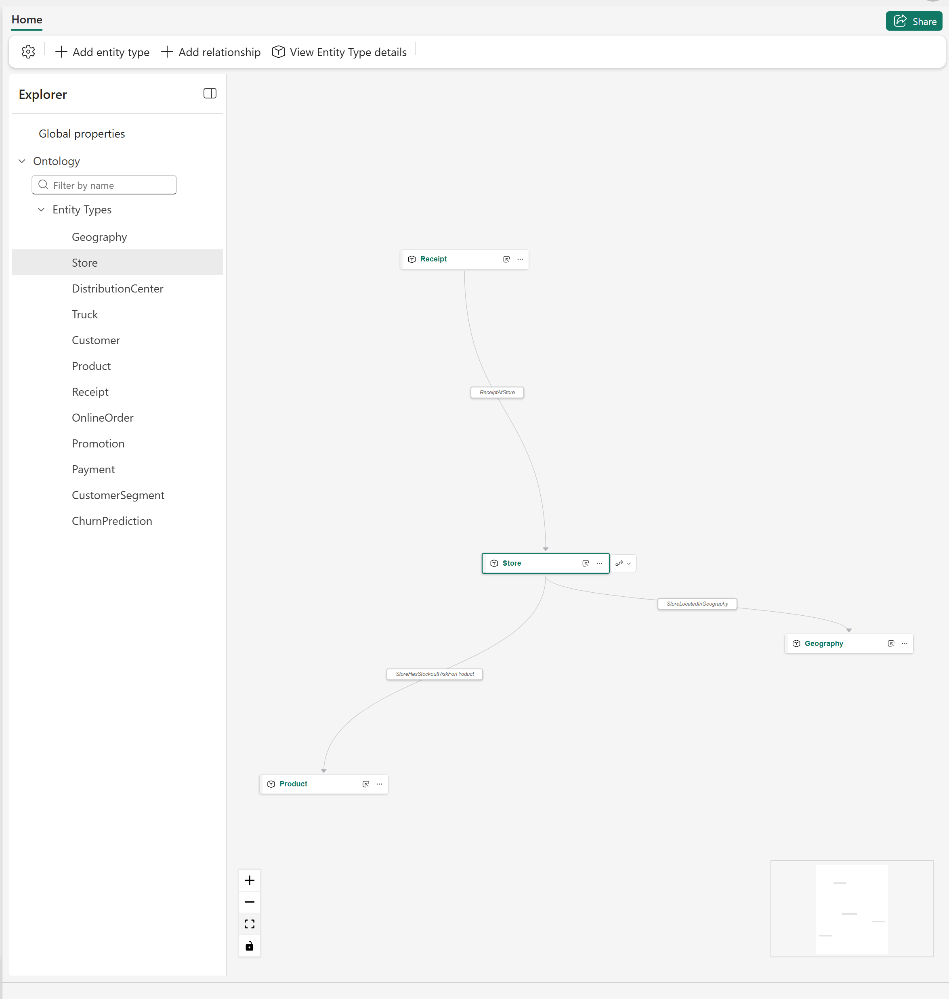
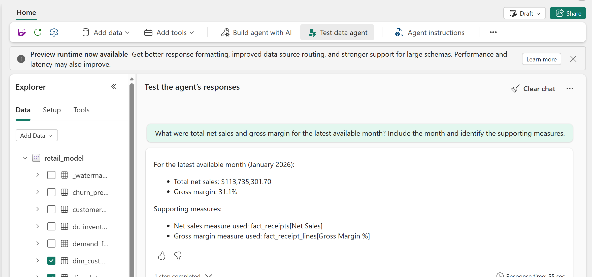
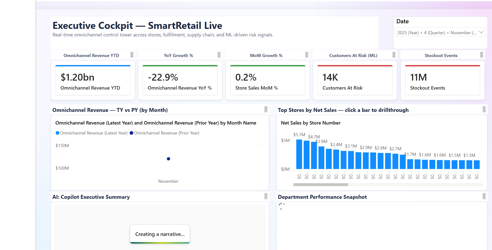
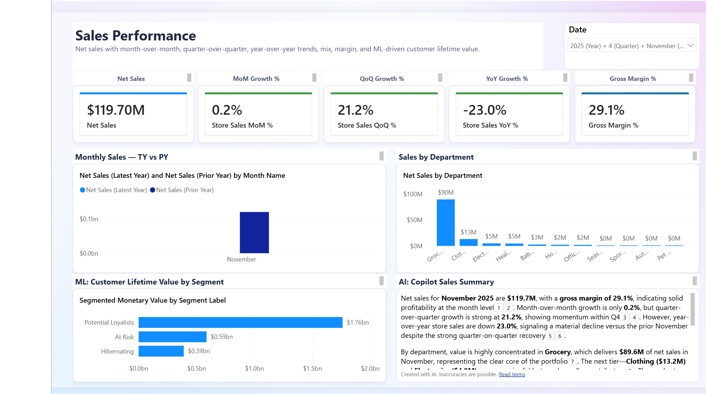
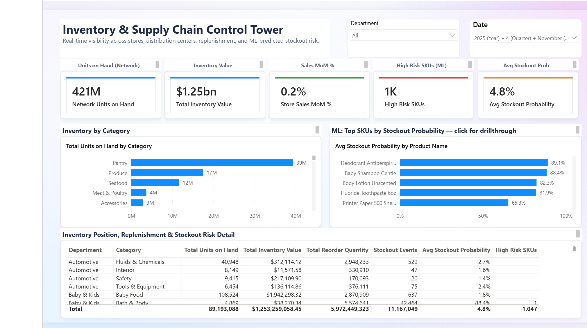
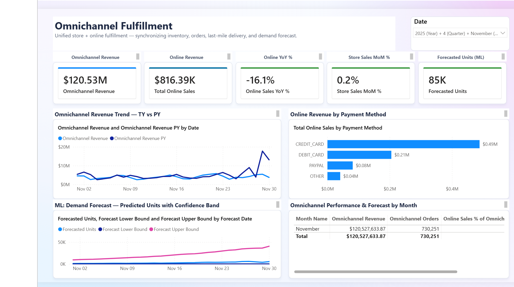
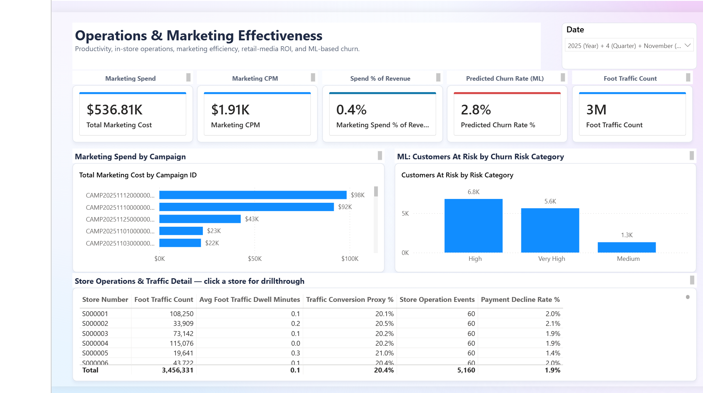

# Deployed walkthrough: analytics and AI

- **Audience:** Retail, analytics, and business stakeholders
- **Duration:** 10-15 minutes
- **Data:** Synthetic

Use this page after the
[deployed walkthrough overview](deployed-walkthrough.md) to show business
context, grounded agent answers, and the Power BI outcome.

!!! note "Optional surfaces"

    Ontology and data-agent experiences require valid source bindings,
    permissions, and capability support. Skip a surface that has not passed
    its preflight checks.

## 1. Show business context in the ontology

An ontology is a business map that connects concepts such as Store, Product,
Customer, and Receipt to the underlying data. Show this section only after
deployment confirmed that the ontology exists and points to the intended
Lakehouse and Eventhouse sources.

1. Open the **Ontologies** folder.
2. Open **Retail Ontology**.
3. Select the `Store` entity type.
4. Use **Fit view** to show its connected entities.



*The selected Store entity connects operational data to Receipt, Geography,
and Product business concepts.*

Explain that the ontology adds shared business meaning over existing Lakehouse
and Eventhouse data. It does not replace the physical schema or create a second
copy of the source data.

## 2. Test a grounded data-agent answer

If the semantic-model agent passed its source and permission checks:

1. Open the **Agents** folder.
2. Open `retail-semantic-model-agent`.
3. Select **Test data agent**.
4. Ask for the latest available month, total net sales, gross margin, and the
   supporting measures.



*The data agent returns the selected period, values, and supporting semantic
model measures so the answer can be checked against the report.*

The agent's latest available month can differ from the report's current date
filter. The agent queries the current semantic model, while deployment saves
the report's date filter to the month containing the configured history end
date. State both periods before comparing values. If they differ, use the
period written in the agent response and change the report filter to the same
month before quoting a comparison. Treat every generated answer as a
hypothesis to verify against measures, query output, and source timestamps.

Skip an agent when it has no selected data sources, returns an error, or has
not passed its capability and access checks. The ontology graph can still be
shown independently when its bindings are valid.

## 3. Close with the Power BI outcome

1. Open the **Reporting** folder.
2. Open the `retail_model` report.
3. Start on **Executive Cockpit**.
4. Continue to **Sales**, **Supply Chain Control Tower**, **Omnichannel
   Fulfillment**, or **Operations & Marketing** when the audience wants more
   detail.



*The Executive Cockpit combines omnichannel performance, store comparisons,
ML risk signals, and an AI-generated narrative over the Direct Lake semantic
model.*

Direct Lake is the Power BI connection mode that reads Lakehouse tables
directly without importing another data copy. The report opens on the latest
month generated by this deployment, not a hard-coded month shared by every
workspace.

State the selected data period before discussing a value. All values are
synthetic, and an AI-generated narrative can contain inaccuracies. Use the
underlying measures and source timestamps as evidence.

### Report page gallery

=== "Sales"

    

    *Sales Performance combines revenue, growth, margin, department mix, and
    customer-lifetime-value signals.*

=== "Supply chain"

    

    *The control tower combines inventory position, replenishment, and
    ML-predicted stockout risk.*

=== "Omnichannel"

    

    *Omnichannel Fulfillment combines store and online revenue with payment
    mix and demand forecasting.*

=== "Operations and marketing"

    

    *Operations and Marketing combines campaign spend, churn risk, foot
    traffic, store operations, and payment-decline context.*

## Connect from VS Code (MCP)

Both the Data Agent and the Ontology expose **streamable-HTTP MCP servers**, so you
can talk to them directly from VS Code's agent-mode chat (Copilot) to experiment with
questions before wiring them into the [agentic application](../design/architecture/agentic-application.md).
Each call is a single JSON-RPC `POST` authenticated with a **Fabric bearer token**.

The endpoint URLs follow these shapes (substitute your workspace, data-agent, and
ontology-item GUIDs):

```text
# Data Agent (semantic model)
https://api.fabric.microsoft.com/v1/mcp/workspaces/{workspaceId}/dataagents/{dataAgentId}/agent

# Ontology (business graph)
https://api.fabric.microsoft.com/v1/mcp/dataPlane/workspaces/{workspaceId}/items/{ontologyItemId}/ontologyEndpoint
```

**1. Sign in** to the tenant that owns the workspace:

```powershell
az login
```

**2. Mint a Fabric token** (valid ~60–75 min — copy the output):

```powershell
az account get-access-token --resource https://api.fabric.microsoft.com --query accessToken -o tsv
```

**3. Add `.vscode/mcp.json`** (the `.vscode/` folder is gitignored). VS Code prompts
for the token once per session and passes it in the `Authorization` header:

```json
{
  "inputs": [
    {
      "type": "promptString",
      "id": "fabric-token",
      "description": "Fabric bearer token (az account get-access-token --resource https://api.fabric.microsoft.com --query accessToken -o tsv)",
      "password": true
    }
  ],
  "servers": {
    "retail-data-agent": {
      "type": "http",
      "url": "https://api.fabric.microsoft.com/v1/mcp/workspaces/{workspaceId}/dataagents/{dataAgentId}/agent",
      "headers": { "Authorization": "Bearer ${input:fabric-token}" }
    },
    "retail-ontology": {
      "type": "http",
      "url": "https://api.fabric.microsoft.com/v1/mcp/dataPlane/workspaces/{workspaceId}/items/{ontologyItemId}/ontologyEndpoint",
      "headers": { "Authorization": "Bearer ${input:fabric-token}" }
    }
  }
}
```

**4. Start the servers** — click the **Start** code-lens above each server in
`.vscode/mcp.json` (or run **MCP: List Servers** from the Command Palette), paste the
token, then open Copilot Chat in **Agent** mode and confirm both tools are enabled.

The Data Agent advertises one tool (`DataAgent_<name>`); the Ontology advertises
`list_ontology_entity_types` and `search_ontology`. When calls start returning **401**,
the token has expired — re-mint it (step 2) and **MCP: List Servers → Restart**.

!!! tip "Which one to ask"

    The **Data Agent** is best at aggregates, rankings, and trends ("top 10 products by
    revenue last quarter"). The **Ontology** is best at single named-entity 360 lookups
    ("what segment is loyalty member LC012304678 in, and their churn probability?") and
    tends to error on deep multi-hop scans.

## Analytics and AI validation

| Interaction | Expected result |
| --- | --- |
| Select the ontology `Store` entity | Related business entities and relationship names appear in the graph. |
| Ask the semantic-model agent for latest sales | The answer includes a data period and supporting measures that can be independently checked. |
| Open Executive Cockpit | Report visuals load for the selected data period without model or binding errors. |

Return to the [walkthrough overview](deployed-walkthrough.md) or use a focused
[presenter journey](presenter-journeys.md).
