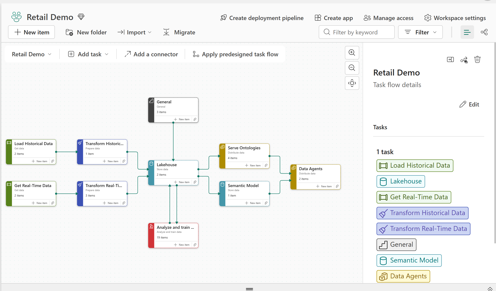

# Deployed solution walkthrough

- **Audience:** Retail, analytics, and technology stakeholders
- **Duration:** 3-5 minute orientation; 15-25 minutes for the full walkthrough
- **Data:** Synthetic

Use this guide for a browser-first tour of a deployed Microsoft Fabric Retail
Demo workspace. It complements the [presenter demo](demo-script.md), which
contains the detailed talk track and support boundaries.

!!! note "Representative screenshots"

    The screenshots show a representative deployment. Fabric navigation,
    generated values, item counts, and data timestamps can vary by deployment
    and run date. Validate freshness before presenting any value as current.

## Before you start

1. Complete [Getting started](getting-started.md).
2. Open the deployed Fabric workspace.
3. Confirm that `retail_lakehouse`, `retail_eventhouse`, the KQL queryset,
   `retail_model`, the pipelines and notebooks, and any optional ontology or
   agent items you plan to show are available.
4. Run the historical setup notebooks. Run `stream-events.ipynb` only when the
   walkthrough needs recent Eventhouse data.

## 1. Orient the audience in the workspace

Open the workspace task flow and select the **Retail Demo** flow.

*The task flow groups ingestion, transformation, storage, semantic, ontology,
ML, and agent assets into one workspace-level map. Required ML points into the
Semantic Model; post-Reporting optional and experimental ML points out from it
so those extensions are not presented as Reporting prerequisites.*

Use the flow to explain three paths:

- **Historical:** load and transform deterministic retail history into the
  Lakehouse.
- **Live:** send typed retail events to Eventhouse and optionally project them
  into Lakehouse tables.
- **Serving:** expose curated data through the semantic model, Power BI,
  ontology, and data-agent surfaces.

The task flow is a navigation aid. It does not prove that a notebook, pipeline,
or stream completed successfully.

## Continue the walkthrough

Choose the page that matches the audience:

| Walkthrough | Use it for |
| --- | --- |
| [Data platform](deployed-data-platform.md) | Pipelines, Spark notebooks, Lakehouse history, and Eventhouse/KQL |
| [Analytics and AI](deployed-analytics-ai.md) | Ontology, grounded data-agent answers, and the Power BI report |

For the complete demo, present the data platform first and finish with
analytics and AI. For a business audience, use this overview and go directly
to Analytics and AI.

## Shared support boundaries

- Screenshots show a representative deployment; item counts, values, and
  timestamps vary.
- A task-flow node or pipeline canvas is navigation context, not execution
  evidence.
- Validate the selected data period before discussing any value.
- Skip optional ontology, agent, ML, or live-streaming surfaces that have not
  passed their source, permission, and capability checks.

## Walkthrough validation

| Interaction | Expected result |
| --- | --- |
| Open the Retail Demo task flow | Historical, live, storage, semantic, ontology, ML, and agent tasks are visible. |
| Open the Data platform guide | Pipeline, notebook, Lakehouse, and Eventhouse steps are available without analytics detail. |
| Open the Analytics and AI guide | Ontology, agent, and report steps are available without implementation detail. |

For a timed presentation, continue with the
[presenter demo](demo-script.md) or a focused
[presenter journey](presenter-journeys.md).
