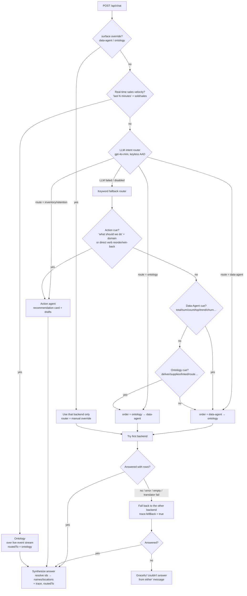

# Chat Orchestrator — How Questions Are Routed

> How the Retail Intelligence chat (`app/`) decides whether a question is answered by the
> **Fabric Data Agent** (semantic model), the **Ontology MCP** (knowledge graph), or an
> **Action agent** (Inventory / Retention) — and how it falls back when the first choice
> can't answer.

The whole orchestrator lives in `app/backend/main.py` (the `/api/chat` handler, `_orchestrate`,
`_route_with_reason`, `_action_route`) plus the LLM classifier in `app/backend/llm_router.py`.

---

## 1. The three (four) destinations

| Route | Backend | Best for |
|---|---|---|
| **data-agent** | Fabric Data Agent over the `retail_model` semantic model (Direct Lake) | Aggregates, KPIs, totals/averages, rankings, trends, time windows, ML rollups, broad multi-hop scans over many rows |
| **ontology** | Ontology MCP (graph of entities + relationships, incl. Eventhouse telemetry) | A **single named entity** (a customer's loyalty card, a product, a store) fused with its ML predictions + live event telemetry through the graph; 1‑hop "which X is linked to named Y" lookups |
| **inventory** | Inventory & Replenishment **action agent** | The user asks what to **do** about stock / replenishment (action verbs) → recommendation card + drafted reorders |
| **retention** | Customer Retention **action agent** | The user asks what to **do** about churn / retention → recommendation card + drafted win‑back campaign |

The action agents (`inventory`, `retention`) are terminal — they own their own answer and never
fall back. `data-agent` and `ontology` are a **paired ranking**: one is tried first, the other is
the automatic fallback.

---

## 2. The decision flow

---

## 3. Step-by-step

The handler evaluates these gates **in order**; the first match wins.

1. **Manual override (`surface`)** — if the API request sets `"surface": "data-agent"` or
   `"ontology"`, that single backend is used (no fallback). Used for debugging / the UI's
   force-a-source control. Router label = *manual override*.

2. **Real-time sales-velocity shortcut** — questions like *"which sold the most in the last 15
   minutes"* (regex on *last/past N minutes/hours* + a sales verb). The historical semantic model
   has no last-15-minutes data, so these go to the **ontology** over the live event stream
   (Store + `receipt_created`), aggregating live receipt events per store. `routedTo = ontology`.

3. **LLM intent router** (`llm_router.classify`) — the primary brain. A small, fast,
   `temperature=0` JSON classification call (Azure OpenAI **gpt-4o-mini** by default, keyless via
   `az login`; swappable to Claude with `RETAIL_LLM_PROVIDER=anthropic`). It returns
   `{"route", "reason"}` using a system prompt + ~14 few-shot examples that encode the policy:
   - **One named entity + its connected business/ML/telemetry context → ontology** (Customer-360,
     "which stores are at risk of selling out *White Truffle Powder*", "for store S000028, how many
     `stockout_detected` events and which products").
   - **Aggregates / rankings / trends / ML rollups / broad multi-hop scans → data-agent.**
   - **An action verb** (should, do, prevent, draft, create, reorder, replenish, launch, recommend)
     **+ a domain → inventory / retention.** A bare *"which … are at risk"* (no action verb) is a
     lookup, **not** an action.

   The chosen route also sets the fallback order: `data-agent` → `[data-agent, ontology]`;
   `ontology` → `[ontology, data-agent]`.

4. **Keyword fallback router** — if the LLM call fails, times out, returns bad JSON, or is disabled
   (`RETAIL_LLM_ROUTER=0`), a deterministic keyword router takes over so routing **never breaks**:
   - `_action_route`: an **action cue** (`what should we do`, `recommend`, `how do we`, …) plus an
     inventory/retention **domain** word, *or* a direct verb (`reorder`, `replenish`, `win-back`,
     `retain`, …) → the matching action agent.
   - Else `_route_with_reason`: a **Data-Agent cue** (`total`, `sum`, `count`, `top`, `trend`,
     `churn`, `revenue`, `%`, …) → data-agent first; an **Ontology cue** (`deliver`, `supplies`,
     `linked`, `route`, `which stores`, `connected to`, …) → ontology first; no cue → **data-agent
     first** (the safe default).

5. **Execute + automatic fallback** — the chosen `order` is tried in sequence. A backend "fails"
   (and falls through to the next) when it raises an HTTP/timeout error, returns empty / "no
   results", or the ontology translator emits a transient bad-query error after its retries. If the
   first succeeds, the second is never called. If **both** fail, the user gets a graceful
   *"I couldn't answer that from either…"* message instead of a 500.

6. **Answer synthesis + trace** — ontology answers often come back as bare `store_id` / `product_id`
   integers; the synthesis step resolves them to **store numbers + locations** and **product names**.
   Every response carries `routedTo` and a **trace** (router model, decision reason, steps, the exact
   MCP call, the reconstructed graph path, a raw-row preview, and whether it `fellBack`).

---

## 4. Why two routers?

The LLM router *understands intent* (it can tell "which customers are at risk" — a lookup — from
"churn is rising, what do we do" — an action — even though both say "churn"). The keyword router is
the **safety net**: deterministic, no network dependency, and guarantees the chat keeps working if
Azure OpenAI is unreachable. The LLM is an enhancement, never a single point of failure.

---

## 5. Worked examples

| Question | Route | Why |
|---|---|---|
| "What were total net sales and gross margin company-wide?" | **data-agent** | Aggregate financial metric. |
| "Give me the 360 view of the customer with loyalty card LC012783099." | **ontology** | Single named customer enriched with segment + churn + profile. |
| "Which stores are at risk of selling out White Truffle Powder?" | **ontology** | 1‑hop lookup: a named product's stockout-risk prediction → linked stores (no action verb). |
| "For store S000028, how many `stockout_detected` events and which products?" | **ontology** | One named store's own live event telemetry, walked to its affected products. |
| "Which products sold the most in the last 15 minutes?" | **ontology** | Real-time sales velocity over the live event stream (semantic model has no live data). |
| "How many customers are predicted to churn and their total LTV?" | **data-agent** | Aggregate count/value over the ML churn table. |
| "Stock is running low — what should we do about it?" | **inventory** | Action cue + inventory domain → drafts reorders. |
| "Churn is rising — how do we retain customers?" | **retention** | Action cue + retention domain → drafts a win-back campaign. |

---

## 6. Knobs

| Env var | Effect |
|---|---|
| `RETAIL_LLM_ROUTER=0` | Force the deterministic keyword router (skip the LLM). |
| `RETAIL_LLM_PROVIDER=anthropic` (+ `RETAIL_ANTHROPIC_API_KEY`) | Route with Claude instead of gpt-4o-mini. |
| `RETAIL_ONTOLOGY_TIMEOUT` | Seconds the ontology MCP gets before the orchestrator falls back. |
| Request body `"surface": "data-agent"\|"ontology"` | Force one backend (no routing, no fallback). |
| Request body `"router": "keyword"` | Skip the LLM for that single request. |

> **Note:** only the **router** is a model we control. The actual NL→DAX (Data Agent) and
> NL→graph-query (Ontology) translation runs **inside Fabric** with Fabric's own model and is not
> swappable. The trace names the router model that made the decision.
