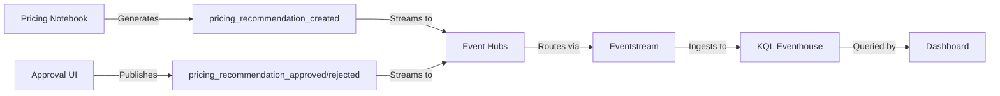

# Dynamic Pricing Approval Dashboard

## Overview

This Real-Time Dashboard implements the human-in-the-loop approval workflow for ML-driven dynamic pricing recommendations (Phase 3 of #199). It provides business users with a comprehensive view of pending pricing changes, their expected impact, and an audit trail of approval/rejection decisions.

## Purpose

The dashboard enables:
- **Review**: Assess pending pricing recommendations with full context
- **Decision-making**: Understand revenue impact, confidence levels, and constraint compliance
- **Monitoring**: Track approval rates, decision times, and realized impacts
- **Audit**: Maintain complete history of who approved/rejected what and why

## Prerequisites

### Required Tables/Events

This dashboard requires the following event tables in the KQL Eventhouse (schema: `cusn`):

#### 1. `pricing_recommendation_created`
Created when the ML pricing engine generates a new recommendation.

**Schema:**
```kql
.create table pricing_recommendation_created (
    event_ts: datetime,
    recommendation_id: string,
    product_id: long,
    product_name: string,
    department: string,
    category: string,
    subcategory: string,
    current_price: decimal,
    recommended_price: decimal,
    expected_revenue_impact: decimal,
    ml_confidence: decimal,
    model_type: string,
    reason_codes: dynamic,
    constraint_status: string,
    constraint_details: dynamic,
    status: string,
    created_by: string
)
```

**Key Fields:**
- `recommendation_id`: Unique identifier for tracking through approval workflow
- `current_price` / `recommended_price`: Price change details
- `expected_revenue_impact`: Estimated revenue delta (positive or negative)
- `ml_confidence`: Model confidence score (0.0 to 1.0)
- `constraint_status`: `ALL_PASS`, `HAS_WARNINGS`, or `BLOCKED`
- `status`: `PENDING`, `APPROVED`, `REJECTED`, `EXPIRED`

#### 2. `pricing_recommendation_approved`
Created when a user approves a pricing recommendation.

**Schema:**
```kql
.create table pricing_recommendation_approved (
    event_ts: datetime,
    recommendation_id: string,
    product_id: long,
    approver_id: string,
    approver_name: string,
    approval_notes: string,
    approved_price: decimal
)
```

**Key Fields:**
- `recommendation_id`: Links back to `pricing_recommendation_created`
- `approver_id`: User who approved (for audit trail)
- `approved_price`: Final approved price (may differ from recommended_price)

#### 3. `pricing_recommendation_rejected`
Created when a user rejects a pricing recommendation.

**Schema:**
```kql
.create table pricing_recommendation_rejected (
    event_ts: datetime,
    recommendation_id: string,
    product_id: long,
    approver_id: string,
    approver_name: string,
    rejection_reason: string,
    rejection_notes: string
)
```

**Key Fields:**
- `recommendation_id`: Links back to `pricing_recommendation_created`
- `rejection_reason`: Categorized reason (e.g., `MARGIN_TOO_LOW`, `COMPETITIVE_PRESSURE`, `SEASONAL_TIMING`)
- `rejection_notes`: Free-text explanation

### Event Streaming Setup

These events should be:
1. Generated by the pricing engine notebook (extension of `15-ml-dynamic-pricing.ipynb`)
2. Sent to Azure Event Hubs with appropriate partition keys
3. Routed via Fabric Eventstream to the KQL Eventhouse
4. Ingested using JSON mapping (see below)

**Sample JSON Ingestion Mapping:**
```kql
.create table pricing_recommendation_created ingestion json mapping 'pricing_recommendation_created_json_mapping'
```json
[
    {"column": "event_ts", "path": "$.event_ts", "datatype": "datetime"},
    {"column": "recommendation_id", "path": "$.recommendation_id", "datatype": "string"},
    {"column": "product_id", "path": "$.product_id", "datatype": "long"},
    {"column": "product_name", "path": "$.product_name", "datatype": "string"},
    {"column": "department", "path": "$.department", "datatype": "string"},
    {"column": "category", "path": "$.category", "datatype": "string"},
    {"column": "subcategory", "path": "$.subcategory", "datatype": "string"},
    {"column": "current_price", "path": "$.current_price", "datatype": "decimal"},
    {"column": "recommended_price", "path": "$.recommended_price", "datatype": "decimal"},
    {"column": "expected_revenue_impact", "path": "$.expected_revenue_impact", "datatype": "decimal"},
    {"column": "ml_confidence", "path": "$.ml_confidence", "datatype": "decimal"},
    {"column": "model_type", "path": "$.model_type", "datatype": "string"},
    {"column": "reason_codes", "path": "$.reason_codes", "datatype": "dynamic"},
    {"column": "constraint_status", "path": "$.constraint_status", "datatype": "string"},
    {"column": "constraint_details", "path": "$.constraint_details", "datatype": "dynamic"},
    {"column": "status", "path": "$.status", "datatype": "string"},
    {"column": "created_by", "path": "$.created_by", "datatype": "string"}
]
```
'''
```

## Dashboard Tiles

### 1. Pending Recommendations Summary
**Purpose:** High-level overview of pending recommendations
**Metrics:**
- Total pending recommendations
- Total expected revenue impact
- Average ML confidence

**Query Logic:** Filters `pricing_recommendation_created` for `status == 'PENDING'`

### 2. Recommendations by Department (Pending)
**Purpose:** Identify which departments have the most pending changes
**Metrics:**
- Count of recommendations per department
- Total revenue impact per department

**Use Case:** Prioritize review by business unit

### 3. Top Pending Recommendations by Revenue Impact
**Purpose:** Surface the most impactful pricing changes for immediate review
**Displays:**
- Product details
- Current vs. recommended price
- Expected revenue impact
- ML confidence
- Constraint compliance status

**Use Case:** Focus on high-stakes decisions first

### 4. Price Change Distribution (Pending)
**Purpose:** Understand the magnitude of proposed changes
**Buckets:**
- Large Markdown (>20%)
- Moderate Markdown (10-20%)
- Small Markdown (5-10%)
- Minimal Change (<5%)
- Small Increase (5-10%)
- Large Increase (>10%)

**Use Case:** Spot unusual patterns (e.g., too many aggressive markdowns)

### 5. Confidence Level Breakdown
**Purpose:** Assess model certainty across recommendations
**Buckets:**
- Very High (≥90%)
- High (70-90%)
- Medium (50-70%)
- Low (<50%)

**Use Case:** Prioritize high-confidence recommendations for auto-approval in future phases

### 6. Constraint Compliance Status
**Purpose:** Track how many recommendations have constraint warnings
**Categories:**
- All Constraints Pass
- Has Constraint Warnings

**Use Case:** Identify recommendations that need extra scrutiny due to business rule conflicts

### 7. Recent Approvals (24h)
**Purpose:** Monitor approval activity in real-time
**Visualization:** Time chart showing approved vs. rejected recommendations

**Use Case:** Track throughput and ensure timely decision-making

### 8. Approval Rate by Confidence Level (7d)
**Purpose:** Validate ML model calibration
**Metrics:** Approval rate percentage by confidence bucket

**Use Case:** If high-confidence recommendations are frequently rejected, the model needs retraining

### 9. Realized Revenue Impact (7d) - Approved Only
**Purpose:** Track cumulative business impact of approved price changes
**Visualization:** Time chart of expected revenue impact

**Use Case:** Measure ROI of dynamic pricing initiative

### 10. Approver Activity (7d)
**Purpose:** Audit trail and workload distribution
**Displays:** Top approvers by number of decisions

**Use Case:** Ensure no single approver is bottleneck; identify training needs

### 11. Average Decision Time (24h)
**Purpose:** Measure workflow efficiency
**Metrics:**
- Average time from recommendation creation to approval/rejection
- Median decision time

**Use Case:** Identify process bottlenecks

### 12. Top Rejected Recommendations by Reason
**Purpose:** Understand common rejection patterns
**Displays:** Rejection reasons ranked by frequency

**Use Case:** Feed insights back to model training (e.g., if many rejections due to "competitive pressure," incorporate competitor pricing data)

## Implementation Steps

### Step 1: Create KQL Tables
Run the following in your Fabric KQL Eventhouse:

```kql
.execute database script <|

// Pricing recommendation created event
.create table pricing_recommendation_created (
    event_ts: datetime,
    recommendation_id: string,
    product_id: long,
    product_name: string,
    department: string,
    category: string,
    subcategory: string,
    current_price: decimal,
    recommended_price: decimal,
    expected_revenue_impact: decimal,
    ml_confidence: decimal,
    model_type: string,
    reason_codes: dynamic,
    constraint_status: string,
    constraint_details: dynamic,
    status: string,
    created_by: string
)

// Pricing recommendation approved event
.create table pricing_recommendation_approved (
    event_ts: datetime,
    recommendation_id: string,
    product_id: long,
    approver_id: string,
    approver_name: string,
    approval_notes: string,
    approved_price: decimal
)

// Pricing recommendation rejected event
.create table pricing_recommendation_rejected (
    event_ts: datetime,
    recommendation_id: string,
    product_id: long,
    approver_id: string,
    approver_name: string,
    rejection_reason: string,
    rejection_notes: string
)
```

### Step 2: Create JSON Ingestion Mappings
(See "Event Streaming Setup" section above for full mappings)

### Step 3: Configure Eventstream
1. In Fabric, navigate to your Eventstream
2. Add source: Azure Event Hubs (pricing events topic)
3. Add destination: KQL Eventhouse tables created in Step 1
4. Apply JSON mappings

### Step 4: Extend Pricing Notebook
Modify `fabric/lakehouse/15-ml-dynamic-pricing.ipynb` to:
1. Generate `recommendation_id` (use UUID)
2. Calculate `expected_revenue_impact` (demand forecast * price change)
3. Set `ml_confidence` (for Phase 1, can be rule-based heuristic)
4. Publish `pricing_recommendation_created` events to Event Hubs

**Sample PySpark code:**
```python
from azure.eventhub import EventHubProducerClient, EventData
import json
import uuid

def publish_pricing_recommendation(product_row):
    event_data = {
        "event_ts": datetime.now(timezone.utc).isoformat(),
        "recommendation_id": str(uuid.uuid4()),
        "product_id": product_row["product_id"],
        "product_name": product_row["ProductName"],
        "department": product_row["Department"],
        "category": product_row["Category"],
        "subcategory": product_row["Subcategory"],
        "current_price": float(product_row["current_price"]),
        "recommended_price": float(product_row["recommended_price"]),
        "expected_revenue_impact": float(product_row["expected_revenue_impact"]),
        "ml_confidence": float(product_row["ml_confidence"]),
        "model_type": product_row["model_type"],
        "reason_codes": product_row["reason_codes"],
        "constraint_status": product_row["constraint_status"],
        "constraint_details": product_row["constraint_details"],
        "status": "PENDING",
        "created_by": "pricing_engine"
    }

    producer.send_event(EventData(json.dumps(event_data)))
```

### Step 5: Import Dashboard Template
1. In Fabric, navigate to your workspace
2. Create new Real-Time Dashboard
3. Import `pricing-approval.template.json`
4. Replace `<fabric-kql-database-resource-id>` with your KQL database resource ID
5. Adjust tile layouts as needed

### Step 6: Build Approval UI (Future Phase)
For full human-in-the-loop workflow, build a custom Power App or Fabric app that:
1. Reads pending recommendations from KQL
2. Displays details and allows approve/reject actions
3. Publishes `pricing_recommendation_approved` or `pricing_recommendation_rejected` events
4. Updates `pricing_recommendation_created.status` (via KQL update policy or separate state table)

**Note:** For Phase 3 MVP, approvals can be simulated via direct KQL inserts or Event Hubs test events.

## Data Flow



## Acceptance Criteria Checklist

- [x] Dashboard shows pending recommendations (**Tiles 1-6**)
- [x] Clear visualization of pricing changes (**Tiles 3-4**)
  - Current vs. suggested price (Tile 3)
  - Expected revenue impact (Tile 3)
  - Confidence level (Tile 5)
  - Constraint compliance status (Tile 6)
- [x] Approve/reject workflow support concept (**Documentation + Event Schemas**)
  - Event schemas defined for approval/rejection
  - Sample PySpark code provided
  - Future UI requirements outlined
- [x] Approval history tracking (**Tiles 7-12**)
  - Recent approvals timeline (Tile 7)
  - Approval rates by confidence (Tile 8)
  - Approver activity audit (Tile 10)
  - Decision time metrics (Tile 11)
  - Rejection reason analysis (Tile 12)

## Future Enhancements

### Phase 4: Automated Approval Rules
- Auto-approve high-confidence, low-impact recommendations
- Route only risky changes to human review
- Implement A/B testing framework

### Phase 5: Feedback Loop
- Track actual revenue impact post-price change
- Compare predicted vs. actual outcomes
- Retrain ML model with approval/rejection signals

### Phase 6: Multi-stage Approval
- Require manager approval for high-impact changes
- Implement approval thresholds by role
- Add escalation workflows

## Testing

### Manual Testing with Synthetic Data

To test the dashboard before full integration:

1. **Insert test events directly into KQL:**

```kql
// Create a pending recommendation
.ingest inline into table pricing_recommendation_created <|
2026-01-28T10:00:00Z,rec-001,12345,"Premium Coffee Beans","Grocery","Beverages","Coffee",15.99,13.59,-240.50,0.85,"RULE_BASED","[\"AGE_MODERATE\"]","ALL_PASS","{}","PENDING","pricing_engine"
2026-01-28T10:05:00Z,rec-002,67890,"Organic Milk","Grocery","Dairy","Milk",4.99,4.49,120.30,0.92,"RULE_BASED","[\"INVENTORY_HIGH\"]","HAS_WARNINGS","{\"warning\":\"Near min margin\"}","PENDING","pricing_engine"

// Approve one recommendation
.ingest inline into table pricing_recommendation_approved <|
2026-01-28T10:30:00Z,rec-001,12345,user-123,"Jane Approver","Looks good, seasonal markdown makes sense",13.59

// Reject another
.ingest inline into table pricing_recommendation_rejected <|
2026-01-28T10:35:00Z,rec-002,67890,user-456,"Bob Reviewer","COMPETITIVE_PRESSURE","Competitor selling at $4.79"
```

2. **Verify dashboard tiles populate correctly**

3. **Test time-based queries** by adjusting `ago()` windows

## Troubleshooting

### Dashboard shows no data
- Verify KQL tables exist: `.show tables`
- Check ingestion status: `.show ingestion failures`
- Confirm events are streaming: `pricing_recommendation_created | take 10`

### Incorrect metrics
- Validate event schemas match ingestion mappings
- Check for null values: `pricing_recommendation_created | where isnull(ml_confidence)`
- Verify time filters are in UTC

### Slow query performance
- Add table policies: `.alter table pricing_recommendation_created policy caching hot = 7d`
- Consider materialized views for frequently accessed aggregations

## Related Files

- **Phase 1 Notebook:** `fabric/lakehouse/15-ml-dynamic-pricing.ipynb`
- **Dashboard Template:** `fabric/dashboards/pricing-approval.template.json`
- **KQL Tables Script:** (To be created in `fabric/kql_database/07-pricing-approval-tables.kql`)
- **Event Schemas:** (To be added to `datagen/src/retail_datagen/streaming/schemas.py`)

## References

- Parent Issue: #199 (ML Enhancement: Dynamic Pricing Recommendations)
- Phase 1 (Rule-based engine): #217
- Phase 2 (ML model): #218
- Fabric Real-Time Dashboards: https://learn.microsoft.com/fabric/real-time-intelligence/dashboard-real-time-create
