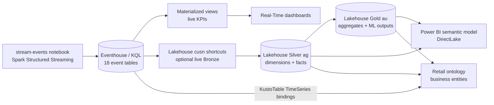
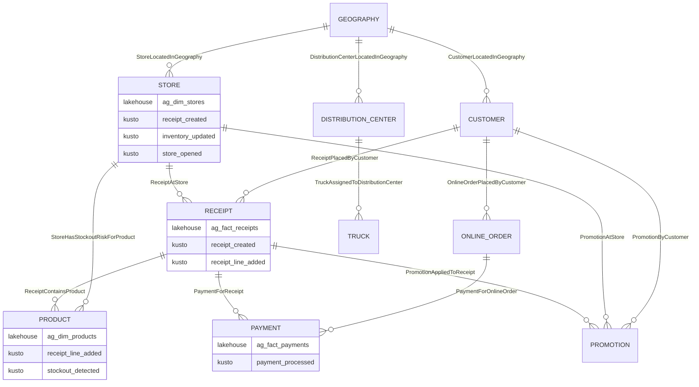

# Architecture

## Overview

This solution demonstrates Microsoft Fabric Real-Time Intelligence using synthetic retail data. It combines streaming analytics (KQL/Eventhouse) with batch processing (Lakehouse/PySpark) to provide both real-time and historical insights.



---

## Data Flows

### Real-Time Path (Hot Path)
**Latency target: < 2 seconds**

1. **`stream-events` notebook** generates synthetic retail events (receipts, inventory, foot traffic)
2. **Spark Structured Streaming** processes micro-batches with `foreachBatch`
3. **Fabric Spark connector for Kusto** appends each `event_type` subset to its typed KQL table
4. **Eventhouse** stores events with materialized views for pre-aggregated KPIs
5. **Real-Time Dashboards** query materialized views
6. **Retail ontology** binds selected Eventhouse tables as TimeSeries sources on
   the same business entities used for Lakehouse history.

### Batch Path (Warm/Cold Path)
**Latency target: < 15 minutes**

1. **Lakehouse Bronze** exposes the data via shortcuts: Eventhouse event tables (`Tables/cusn/`) and ADLS Gen2 historical parquet (`Files/`)
2. **PySpark Notebooks** transform:
   - Bronze → Silver (`ag` schema): field mapping, type casting, watermark-based incremental loads
   - Silver → Gold (`au` schema): aggregations, business metrics
3. **Semantic Model** provides unified view for Power BI

### Ontology Path (Business Map)

The Fabric ontology is a business relationship map, not a graph of event-log
rows. `30-create-ontology.ipynb` creates stable business entities such as
`Receipt`, `Payment`, `Store`, `Product`, and `Customer`.

Each entity keeps its Lakehouse `NonTimeSeries` binding for historical Silver or
Gold data. Where an Eventhouse table contains the same business key, the entity
also receives one or more Eventhouse `KustoTable` TimeSeries bindings. Examples:

- `Receipt`: `ag.fact_receipts` plus `receipt_created` and `receipt_line_added`.
- `Payment`: `ag.fact_payments` plus `payment_processed`.
- `Store`: `ag.dim_stores` plus receipt, payment, promotion, inventory,
  customer, truck, and store-operation event tables.
- `Product`: `ag.dim_products` plus receipt-line, inventory, stockout, and
  reorder event tables.

Business relationships also receive Eventhouse contextualizations where the live
event table carries both keys, such as `ReceiptPlacedByCustomer` via
`receipt_created` and `PaymentForReceipt` via `payment_processed`.



---

## Components

### Data generator (`utility/`)
The Fabric-native `retail-setup` utility generates synthetic retail data directly in Fabric Spark via the setup notebooks, and renders/deploys the Fabric items.

| Module | Purpose |
|--------|---------|
| `src/retail_setup/generation/` | Spark-native dimension, fact, and Gold generation, the table contract (`schemas.py`), and cross-table invariants |
| `src/retail_setup/dictionaries/` | JSON seed dictionaries and store-type profiles |
| `src/retail_setup/config/` | Generation and deployment configuration models |
| `src/retail_setup/cli/` | `retail-setup` CLI (`configure`/`render`/`deploy`) |
| `notebooks/templates/` | Notebook driver templates, including the `stream-events` live driver (`driver-05-stream.py`) |

**Key features:**
- Deterministic, seeded Spark generation (reproducible runs)
- Outputs Delta tables to the Lakehouse (Silver `ag`, Gold `au`)
- Realistic temporal patterns (seasonality, dayparts, holidays)
- Configurable via `utility/config.yaml` and deploy environment YAML

> The legacy FastAPI/DuckDB/Event Hub generator is retained under `datagen-deprecated/` for reference only.

### Fabric KQL Database (`fabric/kql_database/`)
Eventhouse schema and queries.

| Script | Purpose |
|--------|---------|
| `01-create-tables.kql` | Event table definitions, retention/streaming/batching policies |
| `02-create-ingestion-mappings.kql` | JSON ingestion mappings |
| `03-create-functions.kql` | Reusable KQL functions (`fn_attribution_window`, `fn_truck_sla`) |
| `04-create-materialized-views.kql` | Pre-aggregated KPIs (`mv_store_sales_minute`, `mv_top_products_15m`, `mv_sales_product_minute`, `mv_tender_mix_15m`, `mv_zone_dwell_minute`) |
| `06-ml-anomaly-detection.kql` | KQL anomaly detection functions (`fn_detect_*`) |
| `07-pricing-approval-tables.kql` | Pricing approval tables and materialized views |

### Fabric Lakehouse (`fabric/lakehouse/`)
PySpark notebooks for batch transforms.

| Notebook | Purpose |
|----------|---------|
| `01-create-bronze-shortcuts.ipynb` | Create Bronze shortcuts (ADLS parquet + Eventhouse tables) |
| `02-historical-data-load.ipynb` | One-time batch load: `Files/` parquet → Silver (`ag`) → Gold (`au`), plus `dim_date` |
| `03-streaming-to-silver.ipynb` | Incremental: Eventhouse events (`cusn`) → Silver (`ag`), watermark-based |
| `04-streaming-to-gold.ipynb` | Rebuild Gold (`au`) aggregations from Silver |
| `05-maintain-delta-tables.ipynb` | Delta table maintenance (OPTIMIZE/VACUUM) |
| `06`–`14-ml-*.ipynb` | ML notebooks (forecasting, segmentation, churn, pricing, etc.) |

Notebooks are orchestrated by Fabric pipelines in `fabric/pipelines/`: `historical-data-load`, `streaming-data-load` (03 → 04), `daily-maintenance`, and `machine-learning`.

---

## Event Schema

All events use a standard envelope:

```json
{
  "event_type": "receipt_created",
  "payload": { ... },
  "trace_id": "uuid",
  "ingest_timestamp": "ISO-8601",
  "schema_version": "1.0",
  "source": "retail-datagen",
  "correlation_id": null,
  "partition_key": null,
  "session_id": null,
  "parent_event_id": null
}
```

The 18 event types and payload models are defined in `utility/notebooks/templates/driver-05-stream.py`. Events that fail to match a known type land in the `unknown_event` KQL table.

---

## Latency Targets

| Path | Target | Use Case |
|------|--------|----------|
| Hot (KQL) | < 2s | Real-time dashboards, live KPIs |
| Warm (alerts) | < 30s | Stockout alerts, anomaly detection |
| Cold (Lakehouse) | < 15m | Historical reports, trend analysis |

---

## Deployment

See [Setup Guide](../setup/index.md) for deployment instructions. Requires:
- Microsoft Fabric workspace with Eventhouse and Lakehouse

:::note
The live streaming path writes directly from `stream-events.ipynb` to the `retail_eventhouse` KQL database through the Fabric Spark connector for Kusto. The remaining manual deployment task is publishing the Power BI semantic model.
:::

---

## Bronze Layer Architecture

The Bronze layer serves as the data ingestion layer in the Medallion architecture, bringing together batch historical data (ADLSv2 parquet) and real-time streaming data (Eventhouse) into the Lakehouse.

### Schema Naming Convention

| Schema | Layer | Purpose |
|--------|-------|---------|
| `cusn` | Bronze | Eventhouse event table shortcuts (Tables/) |
| `ag` | Silver | Cleaned, deduplicated, typed Delta tables |
| `au` | Gold | Pre-aggregated KPIs for dashboards |

**Note:** ADLS parquet shortcuts are stored in `Files/` (not in a schema).

### Shortcut Locations

| Source | Location | Count |
|--------|----------|-------|
| ADLS Gen2 (parquet) | **Files/** | 24 shortcuts |
| Eventhouse (streaming) | **Tables/cusn/** | 18 shortcuts |

### Data Sources

#### ADLSv2 Parquet (Batch Historical Data) → Files/
- **Storage Account**: `stdretail`
- **Container**: `supermarket`
- **Format**: Parquet (monthly partitions for fact tables)
- **Shortcuts**: 24 folders in Files/

**Dimension Folders (6):**
- `Files/dim_geographies`, `Files/dim_stores`, `Files/dim_distribution_centers`
- `Files/dim_trucks`, `Files/dim_customers`, `Files/dim_products`

**Fact Folders (18):**
- `Files/fact_receipts`, `Files/fact_receipt_lines`, `Files/fact_store_inventory_txn`
- `Files/fact_dc_inventory_txn`, `Files/fact_truck_moves`, `Files/fact_truck_inventory`
- `Files/fact_foot_traffic`, `Files/fact_ble_pings`, `Files/fact_customer_zone_changes`
- `Files/fact_marketing`, `Files/fact_online_order_headers`, `Files/fact_online_order_lines`
- `Files/fact_payments`, `Files/fact_store_ops`, `Files/fact_stockouts`
- `Files/fact_promotions`, `Files/fact_promo_lines`, `Files/fact_reorders`

#### Eventhouse (Real-Time Streaming Data) → Tables/cusn/
- **Database**: `retail_eventhouse`
- **Format**: KQL tables (streaming events)
- **Shortcuts**: 18 tables in cusn schema

**Event Tables by Category:**
- **Transaction (3):** `cusn.receipt_created`, `cusn.receipt_line_added`, `cusn.payment_processed`
- **Inventory (3):** `cusn.inventory_updated`, `cusn.stockout_detected`, `cusn.reorder_triggered`
- **Customer (3):** `cusn.customer_entered`, `cusn.customer_zone_changed`, `cusn.ble_ping_detected`
- **Operational (4):** `cusn.truck_arrived`, `cusn.truck_departed`, `cusn.store_opened`, `cusn.store_closed`
- **Marketing (2):** `cusn.ad_impression`, `cusn.promotion_applied`
- **Omnichannel (3):** `cusn.online_order_created`, `cusn.online_order_picked`, `cusn.online_order_shipped`

### Total Bronze Shortcuts: 42
- **Files/ (ADLS parquet)**: 24 shortcuts (6 dims + 18 facts)
- **Tables/cusn/ (Eventhouse)**: 18 shortcuts

### Data Flow

```
┌─────────────────────────────────────────────────────────────┐
│ ADLSv2 Parquet (Historical)        Eventhouse (Real-Time)  │
│ - 6 Dimension Folders              - 18 Event Tables        │
│ - 18 Fact Folders                  - Streaming from notebook    │
│ - Monthly partitions               - Live events            │
└─────────────────┬───────────────────────────┬───────────────┘
                  │                           │
                  │ (shortcuts)               │ (shortcuts)
                  ▼                           ▼
┌─────────────────────────────────────────────────────────────┐
│                    Bronze Layer                             │
│  ┌─────────────────────┐    ┌─────────────────────────┐    │
│  │ Files/              │    │ Tables/cusn/            │    │
│  │ - 24 parquet folders│    │ - 18 event tables       │    │
│  │ - Read via path     │    │ - Read via schema.table │    │
│  └─────────────────────┘    └─────────────────────────┘    │
└─────────────────────────────────┬───────────────────────────┘
                                  │ (read & transform)
                  ┌───────────────▼───────────────┐
                  │ Silver Layer (ag)             │
                  │ - Combine batch+streaming     │
                  │ - Validate & transform        │
                  │ - Delta format                │
                  └───────────────┬───────────────┘
                                  │ (aggregate)
                  ┌───────────────▼───────────────┐
                  │ Gold Layer (au)               │
                  │ - Pre-aggregated KPIs         │
                  │ - Dashboard-ready             │
                  └───────────────────────────────┘
```

### Data Access Patterns

```python
# ADLS parquet (via Files/)
df = spark.read.parquet("Files/dim_stores")
df = spark.read.parquet("Files/fact_receipts")

# Eventhouse (via Tables/cusn/)
df = spark.table("cusn.receipt_created")
df = spark.sql("SELECT * FROM cusn.inventory_updated")
```

### Implementation

The Bronze layer shortcuts are created via notebook: `fabric/lakehouse/01-create-bronze-shortcuts.ipynb`
