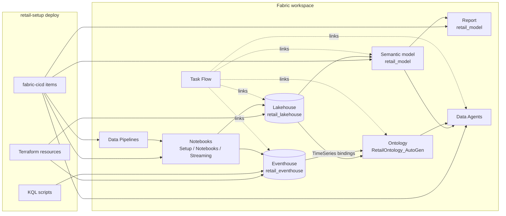

# Fabric Components

Microsoft Fabric assets for the retail demo. Each page documents one component
under `fabric/`.

| Component | Repo folder | Description |
| --- | --- | --- |
| [KQL Database](./kql-database.md) | `fabric/kql_database/` | Eventhouse tables, ingestion mappings, functions, and materialized views |
| [Lakehouse](./lakehouse.md) | `fabric/lakehouse/` | Medallion notebooks, ML notebooks, and utilities |
| [Pipelines](./pipelines.md) | `fabric/pipelines/` | Data Pipelines (setup, streaming, maintenance, ML) deployed automatically |
| [Querysets](./querysets.md) | `fabric/querysets/` | Curated KQL queries deployed as one KQLQueryset |
| [Data Agents](./data-agents.md) | `fabric/data-agents/` | Conversational agents over the semantic model and ontology |
| [Task Flow](./taskflow.md) | `fabric/taskflow/` | Visual item graph wiring the workspace |
| [Rules](./rules.md) | `fabric/rules/` | Real-time alert queries |
| [Dashboards](./dashboards.md) | `fabric/dashboards/` | Dashboard templates and notes |
| [Semantic Model](./semantic-model.md) | `fabric/powerbi/` | Power BI PBIP semantic model and report |

`retail-setup deploy` publishes items into named workspace folders: **Notebooks**
(demo/pipeline notebooks), **Setup** (one-time setup notebooks), **Reporting**
(semantic model + report), **Pipelines** (Data Pipelines), and **ML** (bootstrapped
MLflow experiments). The Lakehouse and queryset stay at the workspace root.

## Data flow



## Current schema source of truth

For new workspace setup, Lakehouse table schemas are defined in:

```text
utility/src/retail_setup/generation/schemas.py
```

The legacy `datagen-deprecated/` package remains a reference for the old
DuckDB/parquet/Event Hub workflow.

## Related documentation

- [Architecture Overview](../architecture/index.md)
- [Setup Guide](../setup/index.md)
